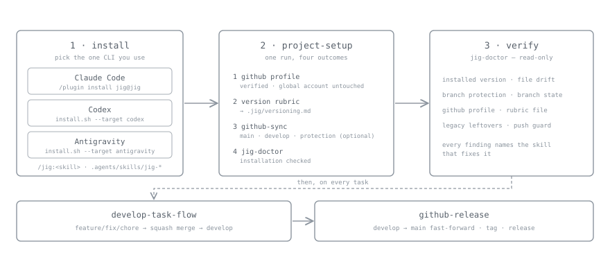

# SPAI

**Scaffolded Procedures for AI Agents** — a harness setup tool that installs repository operating procedures into AI agent CLI environments.

[한국어](README.ko.md)

## What This Is

Using AI agents (Claude Code, Codex, Antigravity CLI) across side projects means re-explaining branch rules, commit rules, and release procedures to every project and every agent. SPAI removes that repetition: it installs the same set of procedure skills into any agent environment, and manages updates and health checks after the install.

Supported: **Claude Code** (recommended), **Codex**, **Antigravity CLI**

## Quick Start



You need a git repository, plus `curl` or `wget` for Codex and Antigravity. A `gh` login is required to converge GitHub settings, but not to install the skills.

### 1. Install — pick the one CLI you use

**Claude Code** (recommended) — run inside a session.

```text
/plugin marketplace add 0x0w1/spai
/plugin install spai@spai
```

**Codex** — run from the repository root.

```bash
curl -fsSL https://raw.githubusercontent.com/0x0w1/spai/main/install.sh \
  | sh -s -- --target codex --scope project
```

**Antigravity CLI**

```bash
curl -fsSL https://raw.githubusercontent.com/0x0w1/spai/main/install.sh \
  | sh -s -- --target antigravity --scope project
```

### 2. Bind the repository

Run `project-setup` in an agent session: `/spai:project-setup` on Claude Code, `spai-project-setup` on Codex and Antigravity.

One run settles four things.

1. Selects and verifies the GitHub profile this repository uses (the globally active account is left alone)
2. Settles the version grading rubric and records it in `.spai/versioning.md`
3. Converges the `main` and `develop` branches and their protection through `github-sync`
4. Checks the installation with `spai-doctor`

### 3. Verify

Run `/spai:spai-doctor` (`spai-doctor` on Codex and Antigravity) for a read-only report on the installed version, file drift, branch protection, the GitHub profile, and the rubric file. Anything that needs fixing is reported along with the skill that fixes it.

### From there, the daily loop

| What you want | Skill to run |
|---|---|
| Take a feature or fix through to `develop` | `develop-task-flow` |
| Promote `develop` to `main` and publish a release | `github-release` |
| Decide which version rubric this project uses | `version-rubric`, or `rubric-scan` when the type is unclear |
| Move an installation to the latest SPAI | `spai-update` |

Call a skill by name or just say what you want; the agent picks it. What gets installed and where is in the [installation guide](docs/installation.md).

## Why It Exists

Unlike a plain collection of skills, SPAI manages two things together.

1. **Repository state convergence** — it ships more than session procedures. The branch model, branch protection, and release discipline are *repository state*, converged by `github-sync` and diagnosed by `spai-doctor`. Rules that are enforced, not rules in a document.
2. **Cross-agent consistency plus lifecycle** — one procedure source (`skills/`) is rendered into each CLI's format and distributed, then managed after install by `spai-update` and `spai-doctor`. Each CLI gets its own native distribution: a plugin for Claude Code, `spai-` prefixed files for Codex and Antigravity.

Skills provided:

| Skill | Role |
|---|---|
| `develop-task-flow` | Work on a `feature/fix/chore` branch, then squash merge into `develop` |
| `github-release` | Fast-forward `develop` to `main`, compute the version, tag and publish the release |
| `github-sync` | Converge the `main` and `develop` branches and their protection; install the local `pre-push` guard |
| `project-setup` | Select and verify the per-repository GitHub CLI profile after installing SPAI |
| `spai-update` | Move an installation to the latest SPAI release |
| `spai-doctor` | Diagnose the installation (version, drift, protection, legacy leftovers); read-only |
| `readme` | Classify the project type and draft `README.md`; check an existing README against the code and fix the drift |
| `version-rubric` | Settle how this project grades `patch`/`minor`/`major` in `.spai/versioning.md`, and re-set it at any time. Ships the per-type rubric catalog |
| `rubric-scan` | Scan the repository to classify its project type and recommend a rubric from the catalog; read-only |

Skill bodies and the rubric catalog are written in English, so the same document is read no matter which language a repository works in. What a skill **produces** — reports, commit bodies, release notes, a README — follows the language that repository already uses, and falls back to English only when there is nothing to go on.

There is a **single merge flow, solo-cli**: a work branch is squash-merged into `develop` locally with `git merge --squash` and pushed directly. No pull requests. A team PR flow is a deferred candidate in the [roadmap](docs/roadmap.md).

## Documentation

The documents below are written in Korean.

- [Installation guide](docs/installation.md): what is installed where for each CLI, and how it is managed and removed afterwards.
- [Version rubric](docs/version-rubric.md): how an installed project grades `patch`/`minor`/`major` on its own terms, plus the `.spai/versioning.md` file contract and its settings.
- [Rubric catalog by project type](skills/version-rubric/rubrics/INDEX.md): 17 rubric drafts, from API servers, clients, libraries, CLIs, workers, and infrastructure through document archives, content sites, design assets, datasets, configuration collections, and course material — plus the detection signal table `rubric-scan` uses. Written in English.
- [Versioning policy](docs/versioning.md): commentary on how SPAI itself grades releases. The normative source is `.spai/versioning.md`.
- [GitHub repository settings](docs/github-repository-settings.md): the GitHub settings the installer applies in project scope, and the branch protection it hands over manually.
- [Roadmap](docs/roadmap.md): SPAI's identity and its trigger-conditional direction candidates.

## Installation Details

The commands are in [Quick Start](#quick-start). This section covers how the paths differ and what the options do. What lands where is in the [installation guide](docs/installation.md).

**Claude Code is the recommended path.** The plugin host manages install, update, and removal, and the `PreToolUse` guard hook that inspects push commands before they run ships only with the Claude Code plugin. Codex and Antigravity have no plugin system, so `install.sh` copies files instead.

### Main installer options

| Option | Description |
|---|---|
| `--target codex\|antigravity` | The one CLI to install (required) |
| `--scope project\|global` | Install scope; defaults to `project` |
| `--github-profile <profile>` | Profile to use when the install should also wire up GitHub (optional) |
| `--github-host <host>` | GitHub Enterprise host |
| `--version vX.Y.Z` | Install or roll back to a specific SPAI release |
| `--skills a,b,c` | Install only the selected skills from the manifest |
| `--configure-git-user` | Set the local `user.name` and `user.email` |
| `--dry-run` | Show what would change without touching files |
| `--force` | Replace an existing managed file that carries no SPAI marker |

### After installing

Installing the skills needs no GitHub profile. Once the install finishes, running the `project-setup` skill selects the per-repository GitHub profile, settles the version rubric, and continues into `github-sync` and `spai-doctor`. It is `/spai:project-setup` on Claude Code and `spai-project-setup` on Codex and Antigravity.

The version rubric differs per project. `project-setup` shows the default and asks whether to use it as-is, and records the result in `.spai/versioning.md`. The `version-rubric` skill can re-settle it at any time; see [version rubric](docs/version-rubric.md) for the details.

A profile stores the login name, never a token. `SPAI_GITHUB_PROFILE` is used as a session override when set; otherwise the login is stored in `git config --local spai.githubProfile your-account`. SPAI skills then use that profile's credential from the `gh` secure store per command, so the globally active account never changes.

## Skill Ownership and Name Collisions

Skills SPAI installs are **managed independently of the skills you wrote yourself.** How that works depends on the target CLI.

**Claude Code — plugin namespace**

No skill file is copied into `.claude/skills/`. Claude Code namespaces plugin skills automatically and exposes them as `/spai:github-release`, so **a skill of your own named `/github-release` and the SPAI one both survive** side by side. Install, update, and removal are the host's job.

**Codex and Antigravity — name prefix**

Neither CLI has a plugin system, so files are copied. Every SPAI skill directory and its frontmatter `name` carries a `spai-` prefix instead.

```text
.agents/skills/spai-github-sync/SKILL.md
.agents/skills/spai-github-release/SKILL.md
.agents/skills/spai-develop-task-flow/SKILL.md
.agents/skills/spai-project-setup/SKILL.md
.agents/skills/spai-update/SKILL.md
.agents/skills/spai-doctor/SKILL.md
.agents/skills/spai-readme/SKILL.md
.agents/skills/spai-version-rubric/SKILL.md
.agents/skills/spai-version-rubric/rubrics/
.agents/skills/spai-rubric-scan/SKILL.md
```

A skill is a directory, not a single file. A skill that ships reference files alongside it, such as `spai-version-rubric`, installs those files too; the installer downloads whatever the release's `dist/files.tsv` lists.

**Reserved names** — SPAI claims only the `spai` plugin name and skill names starting with `spai-`. Keep that prefix off your own skills and nothing collides.

**Managed block** — the SPAI block in `AGENTS.md` and `GEMINI.md` is owned only between its markers, and it lists only the skills actually installed. Your content outside the block is preserved. Claude Code's rules files are never touched.

## Updating

- **Claude Code**: `/plugin marketplace update spai`, then `/reload-plugins`. Marketplace auto-update also refreshes it.
- **Codex and Antigravity**: run the install command again. The installer is idempotent, so it refreshes only changed files (backing them up as `.bak`) and replaces only the managed block between its markers.

Then converge repository settings with `github-sync`. That convergence is idempotent, so one run catches up even across skipped versions.

In an agent environment, the installed `spai-update` skill handles the whole path: it compares the installed state against the latest release, summarizes the notes in between (especially the `### Migration` section), updates each target, and converges with `github-sync`.

## For Contributors: Rebuilding dist

```bash
sh scripts/build-dist.sh
```

`dist/` is regenerated from the skills under `skills/`. The Claude Code plugin payload is `dist/claude-code-plugin/spai`, and the marketplace definition is `.claude-plugin/marketplace.json`.

## For Contributors: Validating dist

```bash
sh scripts/validate-dist.sh
```

Validation checks that the required dist files exist, that the payload file list (`dist/files.tsv`) is present, the managed block markers, the rubric catalog's contract (flat structure, required sections, a `patch` → `minor` → `major` decision order, escalation rules that name a grade), and forbidden strings.

## Notes

- `--target` in `install.sh` is **required and takes exactly one value**. There is no `all`, and `claude-code` is not a target.
- The installer is for Codex and Antigravity only. For Claude Code the plugin host owns install, update, and removal.
- The install script does not prompt to change the local git user during a normal install. Terminal input may still be needed when a `gh` login is required or `--configure-git-user` is used.
- When an existing file has to change, a `.bak` backup is written. Use `--dry-run` to see the planned work without changing anything.
- Project scope can be installed without a GitHub profile first. To wire up GitHub during the install, use `--github-profile <profile>`, `SPAI_GITHUB_PROFILE=<profile>`, or a local `spai.githubProfile`; the older `--github-account` and `SPAI_GITHUB_ACCOUNT` remain supported.
- Without a `.git` repository, GitHub repository settings sync is skipped and logged as a pass.
- `.github/PULL_REQUEST_TEMPLATE.md`, `.github/drafter-config.yaml`, `.github/workflows/drafter.yaml`, and the six release labels installed by earlier versions are no longer used. The `github-sync` skill reports them and asks before cleaning up.

## License

MIT License
