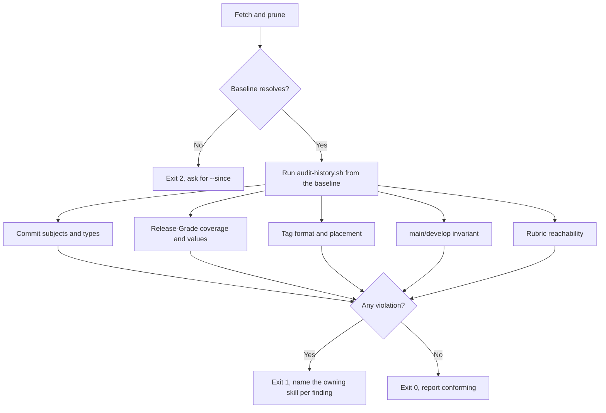

# Conformance Audit

<!-- jig:skill-source-digest cd76b0cdee0d2319d7769f4526b936dd94ed6c5e -->

[한국어](../../ko/skills/conformance-audit.md) · [Skill index](index.md)

## Overview

`conformance-audit` checks after the fact that a repository's history actually followed the jig procedure. It reads commit subjects, `Release-Grade` trailers, tags, and the relationship between `main` and `develop`, then reports violations and notes. It writes nothing and exits non-zero when it finds a violation, so a CI job can gate on it.

## When to use

Use it when adopting jig in an existing repository, before a release, or on a schedule in CI. The push guards block a bad push while it happens; this is the only check that looks at what already landed.

## Invocation and inputs

- Claude Code: `/jig:conformance-audit`
- Codex and Antigravity: `jig-conformance-audit`
- Inputs: the local clone, `origin`, the tag list, and the resolved rubric path
- Optional: `--since <ref>` to set the baseline explicitly

## Why a baseline

A repository that installs jig today has history written under other rules. Judging all of it reports the repository as broken on day one, which teaches the user to ignore the tool.

Every run resolves a baseline first and judges nothing before it:

1. `--since <ref>` when given
2. the commit that added `.jig/versioning.md`, the point the repository adopted the grading contract
3. the oldest `vX.Y.Z` tag
4. nothing resolves → stop with a usage error rather than fall back to the whole history

The baseline and its source appear in every report, because a finding means nothing without it.

## What a missing grade costs

`develop-task-flow` records a `Release-Grade` trailer at merge and `github-release` takes the highest one in the release range as a floor it never lowers. When no commit in the range carries one, that lookup returns an empty string: the release does not fail, does not warn, and grades from the advisory path floor alone. A repository can ship many versions that way with no visible symptom.

So zero coverage is a violation while partial coverage is only a note. Partial adoption is a repository mid-migration; zero is a floor that no longer exists.

## Checks

| ID | What it looks for | Level |
|---|---|---|
| `subject-prefix` | commits with no conventional type | violation |
| `subject-type` | a type outside the documented seven | note |
| `grade-coverage` | no `Release-Grade` in the release range | violation |
| `grade-value` | a trailer that is not one lowercase grade | violation |
| `tag-format` | tags outside `vX.Y.Z` | violation |
| `tag-on-main` | a version tag `main` cannot reach | violation |
| `main-ancestry` | `main` is not an ancestor of `develop` | violation |
| `main-lineage` | commits on `main` unreachable from `develop` | violation |
| `rubric-tracked` | the rubric is missing, untracked, or uncommitted | note |

## Workflow



## Running it in CI

```bash
sh scripts/audit-history.sh --quiet
```

Paths are relative to the skill directory. Exit codes are the contract: `0` conforming, `1` violations found, `2` usage or environment error. The script prefers `origin/<branch>` over the local branch so a stale checkout does not change the verdict.

## Reads and writes

It reads commits, trailers, tags, branches, and the rubric path. It writes nothing at all — not the working tree, not `.git`, not `.jig/`. The output is a report and an exit code.

## Stop conditions and safety

- History is never rewritten to satisfy a finding: no rebase, amend, filter-branch, or force push.
- A missing trailer on a past commit is not repairable; it is recorded as observed and graded correctly from the next task on.
- Tags and GitHub releases are never created, moved, or deleted.
- Branches are never deleted; that belongs to [`repo-hygiene`](repo-hygiene.md).
- Without a resolvable baseline it stops instead of judging the whole history.

## Outputs

The report names the baseline and its source, the range examined, each violation and note in one line, the state of the release invariant, any skipped check with its reason, and the next action named as the skill that owns it.

## Related skills

- [`develop-task-flow`](develop-task-flow.md) writes the subjects and grades this skill checks.
- [`github-release`](github-release.md) consumes the grade floor that zero coverage silently empties.
- [`hotfix-flow`](hotfix-flow.md) step 8 restores the invariant `main-ancestry` reports.
- [`repo-hygiene`](repo-hygiene.md) clears clone debris; this skill judges history and deletes nothing.
- [`version-rubric`](version-rubric.md) owns the rubric file `rubric-tracked` looks for.

## Source

- [`skills/conformance-audit/SKILL.md`](../../../skills/conformance-audit/SKILL.md)
