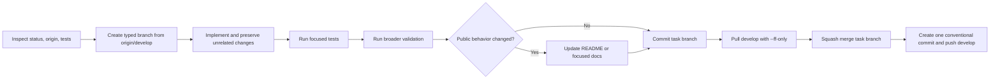

# Develop Task Flow

[한국어](../../ko/skills/develop-task-flow.md) · [Skill index](index.md)

## Overview

`develop-task-flow` is the normal implementation workflow for a jig-managed repository. Every task starts from `origin/develop`, is completed on one typed work branch, is squash-merged locally into `develop`, and is pushed without a pull request.

## When to use

Use it for code, configuration, documentation, generated distribution, installer, or workflow changes. Do not use it to publish a release; `github-release` promotes already-finished `develop` work.

## Invocation and branch model

- Claude Code: `/jig:develop-task-flow`
- Codex and Antigravity: `jig-develop-task-flow`
- `feature/<slug>`: user-visible capability
- `fix/<slug>`: bug, regression, or security correction
- `chore/<slug>`: tooling, docs, refactor, config, or automation

## Workflow

The squash commit is the release-note source. Its subject uses a conventional prefix and its body contains user-facing bullets in the repository's language.

## Reads and writes

It reads Git status, branches, remotes, repository instructions, tests, and relevant code/docs. It creates a task branch, changes only task-scoped files, runs validation, creates the task commit and final squash commit, and pushes `develop`.

## Documentation and safety

- Update both README languages when public workflow, installation, targets, CLI output, or usage changes; move broad explanations into `docs/`.
- Use generic example identities and paths only.
- Never force push, bypass hooks, delete branches, push ordinary work to `main`, or merge failing tests.
- Never include unrelated user changes in the squash commit.
- Leave the work branch in place unless the user explicitly asks to delete it.

## Outputs

The report names the branch, changed files, tests, README/docs status, squash subject pushed to `develop`, blocked commands, and remaining actions.

## Related skills

- [`github-release`](github-release.md) promotes completed `develop` work.
- [`readme`](readme.md) supplies repository-grounded README updates.
- [`jig-doctor`](jig-doctor.md) can verify the installation and branch model.

## Source

- [`skills/develop-task-flow/SKILL.md`](../../../skills/develop-task-flow/SKILL.md)
