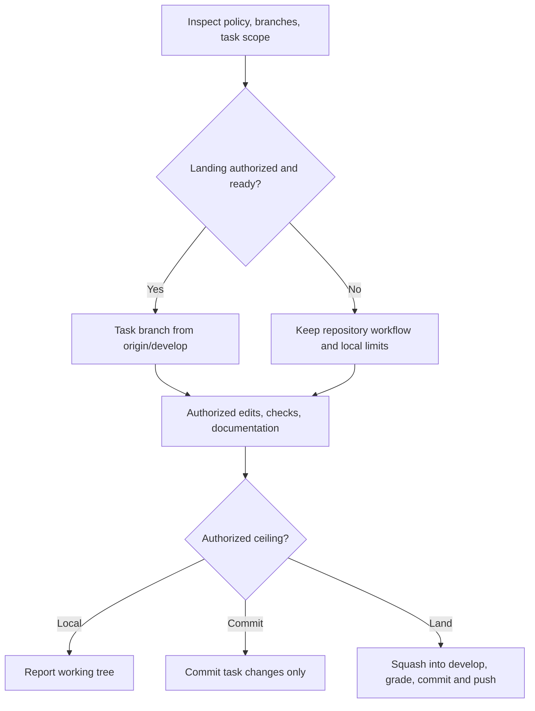

# Develop Task Flow

<!-- jig:skill-source-digest 87cce1e41e86b55f0f65a02a4903cd531a1a5aee -->

[한국어](../../ko/skills/develop-task-flow.md) · [Skill index](index.md)

## Overview

`develop-task-flow` is the normal implementation workflow for a repository that has adopted the jig branch model. A task starts from `origin/develop`, is completed on one typed work branch, is squash-merged locally into `develop`, and is pushed without a pull request.

## When to use

Use it for code, configuration, documentation, generated distribution, installer, or workflow changes. Do not use it to publish a release; `github-release` promotes already-finished `develop` work.

**Installation is not adoption.** Repository instructions or an explicit user decision establish adoption; plugin availability and branch names alone do not. Check `main` and `develop` separately as prerequisites. Missing or unclear adoption keeps the repository's own workflow; a missing branch is reported, not created automatically.

## How far a run goes

Edit/verify, commit, landing, and release are separate stages. Current local/no-commit/no-push limits win. Review alone is read-only. A request to implement authorizes edits and checks, while committing and landing require the current request or an explicitly approved standing repository policy. Reuse that policy without asking each time. A release always needs an explicit request.

A caller such as `readme` or `version-rubric` passes the same ceiling; delegating does not authorize additional Git stages. No new configuration flag is needed.

## Invocation and branch model

- Claude Code: `/jig:develop-task-flow`
- Codex: `jig:develop-task-flow`
- Antigravity: `jig-develop-task-flow`
- `feature/<slug>`: user-visible capability
- `fix/<slug>`: bug, regression, or security correction
- `chore/<slug>`: tooling, docs, refactor, config, or automation

## Workflow

The squash commit is the release-note source. Its subject uses a conventional prefix and its body contains user-facing bullets in the repository's language, ending with a `Release-Grade: patch|minor|major` trailer.

Grading happens at merge rather than at release, because the diff and the tests are still in hand here. The grade comes from the project's own rubric — resolved from `JIG_VERSION_RUBRIC`, `jig.versionRubric`, or `.jig/versioning.md` — applied to the changed paths of this task alone. When the rubric carries an `## Interface Paths` table, the floor is read from it rather than judged by eye: each changed path takes the first matching row, and that floor is advisory. `github-release` later takes the highest grade recorded across the range as its floor. When no rubric resolves, the trailer is omitted rather than guessed.

## Reads and writes

It reads Git status, branches, remotes, repository instructions, tests, and relevant code/docs. It edits and verifies within the requested scope; branch creation, commits, squash merge, and push run only when authorized.

## Documentation and safety

- Update both README languages when public workflow, installation, targets, CLI output, or usage changes; move broad explanations into `docs/`.
- Use generic example identities and paths only.
- Never force push, bypass hooks, delete branches, push ordinary work to `main`, or merge failing tests.
- Never include unrelated user changes in the squash commit.
- Editing files the task requires is the work, not an overwrite. A dirty file alone does not require confirmation: inspect its diff, preserve existing work, and ask only before discarding content outside the approved change.
- Reversible implementation choices are made here; only scope, external behavior, and irreversible operations go back to the user.
- Leave the work branch in place unless the user explicitly asks to delete it.

## Outputs

The report names the scope the run took and what decided it, the branch or why none was created, changed files, tests, README/docs status, squash subject pushed to `develop`, the recorded `Release-Grade` and the rubric question behind it, blocked commands, and remaining actions.

## Related skills

- [`github-release`](github-release.md) promotes completed `develop` work.
- [`readme`](readme.md) supplies repository-grounded README updates.
- [`jig-doctor`](jig-doctor.md) can verify the installation and branch model.

## Source

- [`skills/develop-task-flow/SKILL.md`](../../../skills/develop-task-flow/SKILL.md)
