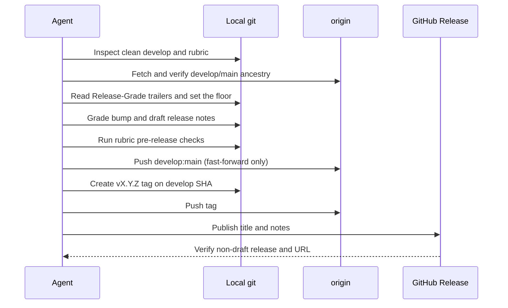

# GitHub Release

<!-- jig:skill-source-digest 05ff8c6611ecd7ce18ef9311279fa09b1838350c -->

[한국어](../../ko/skills/github-release.md) · [Skill index](index.md) · [Version rubric](../version-rubric.md)

## Overview

`github-release` publishes the already-completed `develop` state. It grades the release with the project's own rubric, writes notes from squash commits, fast-forwards `develop` to `main`, tags the exact commit, and creates a GitHub Release from the CLI. There is no release PR, `release/*` branch, or Release Drafter.

## When to use

Use only after the user explicitly asks for a release and all intended changes are already on `origin/develop`. Ordinary unfinished work must first pass through `develop-task-flow`.

## Invocation and inputs

- Claude Code: `/jig:github-release`
- Codex and Antigravity: `jig-github-release`
- Inputs: clean/synced `develop`, latest reachable `vX.Y.Z` tag, project rubric, commit subjects/bodies and their `Release-Grade` trailers, authenticated GitHub profile

## Workflow

Grading starts from the `Release-Grade` trailers that `develop-task-flow` recorded on each squash commit; the highest grade in the range is the floor, and a commit without a trailer is graded from its text and folded in. When the rubric carries an `## Interface Paths` table, a second floor is computed from `git diff --name-only`, where each changed path takes the first matching row. That path floor is advisory — a release may land below it with a recorded reason — while a recorded task grade never is. The rubric then runs over the whole range, which may raise that floor but never lowers it. The rubric's ordered questions stop at the first match, then hard rules may escalate. While the major version is `0`, a `major` grade raises the minor position but remains recorded as `major`.

## Release notes and migrations

Commit prefixes create note sections; commit bodies feed the localized `Summary`. A migration section exists only when downstream projects must act. `migration-auto` contains idempotent mechanical steps; `migration-manual` contains human judgement. Markers count only when they occupy the whole line, and any manual block may escalate the version under the project rubric.

## Reads and writes

The skill reads Git refs/status/logs, `.jig/versioning.md` or its configured override, release tags, and GitHub identity. It pushes `develop:main`, creates and pushes one version tag, and publishes one GitHub Release. It never edits the rubric.

## Stop conditions and safety

- Stop if tracked work is dirty, local `develop` differs from origin, `main` is not an ancestor of `develop`, validation fails, or the tag/release exists.
- If the rubric grade exceeds a user-requested bump, explain and ask before continuing.
- Never force push, bypass hooks, delete branches, weaken migration notes to fit a version, or release unfinished work.
- Show the note draft unless the user already requested end-to-end execution.

## Outputs

The report includes repository/branch, previous/new versions, rubric path/source/kind, the recorded task-grade floor and the commit that set it, graded versus requested bump and deciding question, promotion, tag and release status, summary, blocked commands, and user actions.

## Related skills

- [`develop-task-flow`](develop-task-flow.md) prepares the release range.
- [`version-rubric`](version-rubric.md) owns the grading file.
- [`rubric-scan`](rubric-scan.md) helps choose a project-specific rubric.
- [`jig-update`](jig-update.md) consumes migration blocks after publication.

## Source

- [`skills/github-release/SKILL.md`](../../../skills/github-release/SKILL.md)
- [Version rubric contract](../version-rubric.md)
