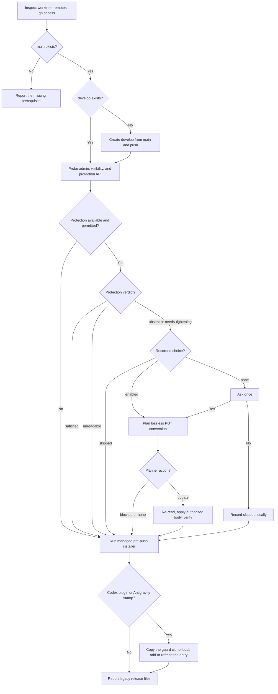

# GitHub Sync

<!-- jig:skill-source-digest f540337856ad091c0c24956d31be7dc804ec0b91 -->

[한국어](../../ko/skills/github-sync.md) · [Skill index](index.md) · [Repository settings](../github-repository-settings.md)

## Overview

`github-sync` converges a repository on jig's CLI release model: `main` and `develop`, optional server-side protection, and two layers of local guard — the git `pre-push` hook, and a `PreToolUse` push hook installed natively for Codex and Antigravity (Claude Code runs the same hook from inside the plugin). It is idempotent and deliberately excludes releases, tags, pull-request templates, labels, and Release Drafter automation.

## When to use

Use it during `jig-setup`, after `jig-update`, when `develop` is missing, when protection or the local guard drifted, or when a clone has not recorded its protection choice. Use `github-release` to publish; sync never creates a release.

## Invocation and prerequisites

- Claude Code: `/jig:github-sync`
- Codex: `jig:github-sync`
- Antigravity: `jig-github-sync`
- Requires a Git repository. GitHub operations additionally require `gh`, repository access, and the profile selected by `JIG_GITHUB_PROFILE` or local `jig.githubProfile`.

## Workflow

jig manages only force-push and deletion blocking. Existing reviews, check app bindings, restrictions, and other repository controls are preserved. Save the HTTP status and response body separately; use `classify-protection.sh --file <response.json>` and `plan-protection.sh < <response.json>` from the skill directory. Both are local, require `jq`, and never call GitHub.

The planner returns `none` for an already satisfied policy, `update` with a PUT-compatible `body` for verified absence or supported tightening, or `blocked` without a body for unreadable/unsupported data. It translates GET flag objects and actor metadata rather than echoing GET JSON into PUT. Unknown fields, incomplete policies, signature settings requiring a separate endpoint, and unknown check app bindings block updates. A generic 404 or authentication/rate-limit error never means absence; only a verified `Branch not protected` response does.

Planning grants no approval. Reuse `enabled` for jig's two guarantees and keep `skipped`; a protected branch does not authorize changing its unprotected sibling. Record satisfaction as `enabled` only if both branches satisfy the baseline and no skipped choice exists. Re-read before an authorized PUT and verify afterward. Changed source data invalidates the plan; concurrent administrator changes remain a limitation because read/write operations are not transactional.

## Reads and writes

The skill reads Git branch/remotes, GitHub repository permissions and protection, `jig.githubProfile`, `jig.githubHost`, and `jig.branchProtection`. It may create and push `develop`, update protection after confirmation, record the local choice, and manage `.git/hooks/pre-push` through its shipped `assets/pre-push` source and `scripts/manage-pre-push.sh` helper.

The local guard blocks deletion and non-fast-forward pushes to `main`/`develop`, and allows `main` updates only from `develop:main`. It is local defense; server-side protection remains authoritative.

The helper installs atomically, repairs a jig-owned drifted copy, and refuses a configured `core.hooksPath`. It never replaces an unmarked user hook without explicit confirmation. If replacement is approved, it preserves that hook as `.git/hooks/pre-push.jig-user-backup`.

The second layer is `scripts/manage-native-hooks.sh`. Codex does not run a plugin's own hooks, so for each detected host it adds one hook entry — `.codex/hooks.json` for Codex, `.agents/hooks.json` for Antigravity — that runs the guard before any shell command; a push the git hook would refuse, or one carrying `--no-verify`, is refused before it runs. Codex counts as detected when the Codex configuration shows the jig plugin installed or the legacy `AGENTS.md` stamp is present; Antigravity counts on its `GEMINI.md` stamp.

The manager copies the shipped `assets/guard-push.sh` clone-local to `<git common dir>/jig/guard-push.sh` and points the entry there, so one entry works whether jig arrived as a plugin or as skill files and survives a plugin upgrade. The entry resolves that path at run time and passes when the copy is absent. Other entries in either file are preserved; merging needs `jq`, and without it the manager writes only a fresh file. Codex runs a hook only after the user reviews it once in `/hooks`; the report says so every time. Project scope only.

## Decision points and safety

- Ask once before enabling available protection unless the checkout already records `enabled` or `skipped`, or both guarantees already hold.
- Never remove or relax a protection the repository already has. Required reviews, required checks, push restrictions, and admin enforcement are the repository's own and survive every sync.
- Never overwrite an unmarked user-authored `pre-push` hook without explicit confirmation and a `.jig-user-backup` copy.
- Never rewrite a user's entry in `.codex/hooks.json` or `.agents/hooks.json`; only the jig-marked entry is added, updated, or removed, and an unparseable file or a symlink is refused.
- Never grant Codex hook trust for the user; report the `/hooks` step instead.
- Never force push, delete branches, create tags/releases, configure `core.hooksPath`, rename the default branch, or silently remove legacy files.
- When protection is unavailable or skipped, report that the local guards are the only barrier on this machine.

## Uninstall cleanup

Run both helpers' `uninstall` modes before removing the skill or plugin from the current project — the native hook manager first, while the guard payload still exists. The native manager removes only its own entry, deletes the file (and an emptied `.codex/`) only when nothing else was in it, and removes the clone-local guard copy once no jig entry points at it; the pre-push manager removes only a hook with the jig ownership marker and restores the confirmed user-hook backup when present. Removing a user/global installation cannot discover every clone, so each project checkout must be cleaned explicitly.

## Outputs

The report lists branch creation/current state, protection per branch as already satisfied/guarantees added/skipped/unavailable/not permitted/unreadable along with any existing protections preserved, local pre-push guard state, the native hook state per detected host (with the Codex `/hooks` trust reminder), legacy files found, blocked commands, and next actions.

## Related skills

- [`jig-setup`](jig-setup.md) selects the GitHub profile before sync.
- [`jig-update`](jig-update.md) delegates repository convergence here after payload updates.
- [`jig-doctor`](jig-doctor.md) diagnoses protection and guard drift without fixing it.
- [`github-release`](github-release.md) consumes the converged branch model.

## Source

- [`skills/github-sync/SKILL.md`](../../../skills/github-sync/SKILL.md)
- [`guard-push.sh`](../../../skills/github-sync/assets/guard-push.sh), the one guard source for every host
- [`classify-protection.sh`](../../../skills/github-sync/scripts/classify-protection.sh), the protection verdict the skill reads
- [GitHub repository settings](../github-repository-settings.md)

- [`plan-protection.sh`](../../../skills/github-sync/scripts/plan-protection.sh) and [`protection-request.jq`](../../../skills/github-sync/scripts/protection-request.jq): local request planning and conservative GET-to-PUT conversion
