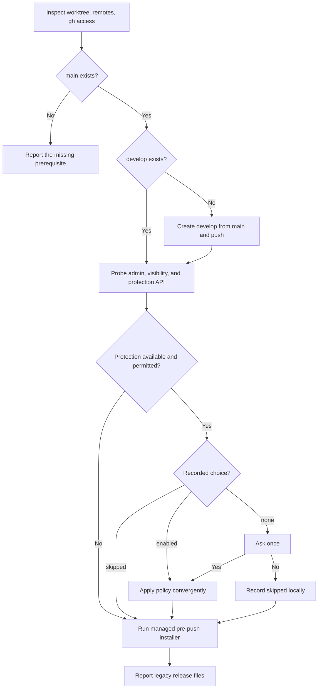

# GitHub Sync

<!-- jig:skill-source-digest 45030d5178a5ce8940bae93441acdb4094bbc8eb -->

[한국어](../../ko/skills/github-sync.md) · [Skill index](index.md) · [Repository settings](../github-repository-settings.md)

## Overview

`github-sync` converges a repository on jig's CLI release model: `main` and `develop`, optional server-side protection, and a local `pre-push` guard. It is idempotent and deliberately excludes releases, tags, pull-request templates, labels, and Release Drafter automation.

## When to use

Use it during `jig-setup`, after `jig-update`, when `develop` is missing, when protection or the local guard drifted, or when a clone has not recorded its protection choice. Use `github-release` to publish; sync never creates a release.

## Invocation and prerequisites

- Claude Code: `/jig:github-sync`
- Codex and Antigravity: `jig-github-sync`
- Requires a Git repository. GitHub operations additionally require `gh`, repository access, and the profile selected by `JIG_GITHUB_PROFILE` or local `jig.githubProfile`.

## Workflow

Protection blocks force pushes and deletion on both branches while allowing direct pushes and requiring neither PR reviews nor status checks. A private repository on a plan without protection normally returns `403`; that is informational, not a defect.

## Reads and writes

The skill reads Git branch/remotes, GitHub repository permissions and protection, `jig.githubProfile`, `jig.githubHost`, and `jig.branchProtection`. It may create and push `develop`, update protection after confirmation, record the local choice, and manage `.git/hooks/pre-push` through its shipped `assets/pre-push` source and `scripts/manage-pre-push.sh` helper.

The local guard blocks deletion and non-fast-forward pushes to `main`/`develop`, and allows `main` updates only from `develop:main`. It is local defense; server-side protection remains authoritative.

The helper installs atomically, repairs a jig-owned drifted copy, and refuses a configured `core.hooksPath`. It never replaces an unmarked user hook without explicit confirmation. If replacement is approved, it preserves that hook as `.git/hooks/pre-push.jig-user-backup`.

## Decision points and safety

- Ask once before enabling available protection unless the checkout already records `enabled` or `skipped`.
- Never overwrite an unmarked user-authored `pre-push` hook without explicit confirmation and a `.jig-user-backup` copy.
- Never force push, delete branches, create tags/releases, configure `core.hooksPath`, rename the default branch, or silently remove legacy files.
- When protection is unavailable or skipped, report that the local guard is the only barrier on this machine.

## Uninstall cleanup

Run the helper's `uninstall` mode before removing the skill or plugin from the current project. It removes only a hook with the jig ownership marker and restores the confirmed user-hook backup when present. Removing a user/global installation cannot discover every clone, so each project checkout must be cleaned explicitly.

## Outputs

The report lists branch creation/current state, protection as applied/skipped/unavailable/not permitted, local guard state, legacy files found, blocked commands, and next actions.

## Related skills

- [`jig-setup`](jig-setup.md) selects the GitHub profile before sync.
- [`jig-update`](jig-update.md) delegates repository convergence here after payload updates.
- [`jig-doctor`](jig-doctor.md) diagnoses protection and guard drift without fixing it.
- [`github-release`](github-release.md) consumes the converged branch model.

## Source

- [`skills/github-sync/SKILL.md`](../../../skills/github-sync/SKILL.md)
- [GitHub repository settings](../github-repository-settings.md)
