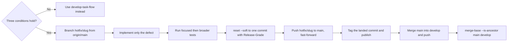

# Hotfix Flow

<!-- jig:skill-source-digest 932b91be4f36a4493469f0404be699f67f887cc8 -->

[한국어](../../ko/skills/hotfix-flow.md) · [Skill index](index.md)

## Overview

`hotfix-flow` ships a fix for a released defect ahead of the work already sitting on `develop`. It branches from `main`, lands one squashed commit back on `main` through the guard-allowed hotfix push, tags and publishes it, and then merges `main` into `develop` so the next ordinary release still fast-forwards.

## When to use

Only when all three hold: the defect is already reachable from `main`, waiting for the next `develop` release is not acceptable, and `develop` holds work that must not ship yet. If `develop` has nothing unreleased, this is not a hotfix — use `develop-task-flow` and release normally.

## Invocation and inputs

- Claude Code: `/jig:hotfix-flow`
- Codex and Antigravity: `jig-hotfix-flow`
- Inputs: a defect reachable from `origin/main`, the latest tag reachable from `main`, the project rubric, an authenticated GitHub profile

## Workflow

### Hotfix triggers

Whether a defect deserves to bypass the `develop` queue is a judgement made while something is on fire, which is the least reliable moment to make it. So the project writes the conditions in advance, in the `## Hotfix Triggers` section of the rubric file, and the run only matches against them.

Every item is an observable state rather than a feeling: "the released CLI exits non-zero on startup" is a trigger, "urgent" is not. A run that cannot name a matching item stops and hands the fix to `develop-task-flow`. The matched item is recorded on the squash commit as a `Hotfix-Trigger:` trailer.

When a project never wrote the section, `hotfix-flow` falls back to the default list it ships, the same way `github-release` falls back to the default rubric. Widening the list to fit a fix in progress is a change to the project's policy: it is committed separately, never folded into the hotfix.

## Why the back-merge is part of the procedure

A hotfix is the only operation that puts a commit on `main` that `develop` does not have. While that divergence stands, `git push origin develop:main` no longer fast-forwards and `github-release` refuses to run rather than force-push. The back-merge is what restores the invariant, so it happens in the same session, not as a follow-up.

Bring it back with `git merge main`, never a cherry-pick. A cherry-pick copies the change under a new SHA and leaves `main` outside `develop`'s history, which breaks every later release. The merge commit itself never reaches release notes, because `github-release` reads `git log --no-merges`.

## Grading and version

The fix is graded against the project rubric resolved from `JIG_VERSION_RUBRIC`, local `jig.versionRubric`, or `.jig/versioning.md`, applied to this fix alone with `git diff --name-only origin/main...HEAD` as evidence and the `## Interface Paths` floor when present. The verdict is recorded as a `Release-Grade` trailer. The version is computed from the latest tag reachable from `origin/main`, and the tag is created on the commit that landed on `main`.

A hotfix is usually `patch` but never automatically so; a fix that changes behavior silently grades higher.

## Reads and writes

It reads Git refs, status, logs, tags, the rubric, and the code under repair. It creates one branch, one squashed commit, one fast-forward push to `main`, one tag, one GitHub Release, and one merge into `develop`. It never edits the rubric and never force pushes.

## Stop conditions and safety

- Stop when `git rev-list --count origin/main..origin/develop` is `0`: with nothing unreleased there is no work to protect, so this is an ordinary task.
- Stop if the three conditions do not hold, or if the push to `main` is rejected. The guard requires the push to fast-forward **and** to be exactly one commit ahead of `main`, which is what mechanically blocks a branch taken from `develop` from carrying unreleased work into the release.
- Never bypass hooks, force push, branch the hotfix from `develop`, or carry anything beyond the defect.
- Never leave `main` ahead of `develop`; the run is not finished until `git merge-base --is-ancestor origin/main origin/develop` succeeds.
- Never resolve a failed `develop:main` fast-forward by force-pushing.

## Outputs

The report names the branch and its `origin/main` starting commit, files changed, tests run, the graded bump with the deciding rubric question and the recorded `Release-Grade`, the tag and release URL, the back-merge and its verification, the unreleased `develop` work deliberately left out, and any blocked commands.

## Related skills

- [`develop-task-flow`](develop-task-flow.md) handles every fix that can wait for the next release.
- [`github-release`](github-release.md) promotes `develop` once the invariant is restored.
- [`github-sync`](github-sync.md) installs the `pre-push` guard that allows the `hotfix/<slug>:main` landing.
- [`version-rubric`](version-rubric.md) owns the grading file.

## Source

- [`skills/hotfix-flow/SKILL.md`](../../../skills/hotfix-flow/SKILL.md)
