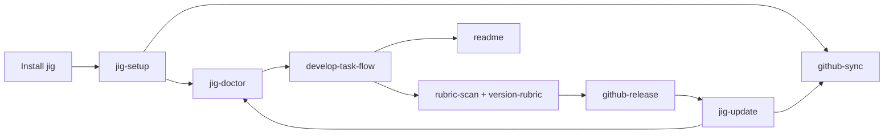

# jig Skill Guides

[한국어](../../ko/skills/index.md) · [Documentation home](../index.md)

jig ships repository procedures, not just prompts. The guides below explain the human-facing contract behind each `SKILL.md`: when it applies, what it can change, where it must stop, and how it delegates to the other skills.

Each language guide records a digest of its complete source skill payload (`SKILL.md`, scripts, assets, references, and catalogs). Distribution validation fails when either language still points at an older payload, forcing both guides to be reviewed whenever a skill changes. After the review, `scripts/update-skill-doc-digests.sh <name>` refreshes the pair.

## Lifecycle

Setup binds the repository to the right GitHub identity, normal work lands on `develop`, releases fast-forward that state to `main`, and update/doctor maintain every detected installation afterwards.

## Choose a skill

| Need | Skill | Claude Code | Codex / Antigravity |
|---|---|---|---|
| Finish setup | [`jig-setup`](jig-setup.md) | `/jig:jig-setup` | `jig-setup` |
| Converge GitHub | [`github-sync`](github-sync.md) | `/jig:github-sync` | `jig-github-sync` |
| Diagnose jig | [`jig-doctor`](jig-doctor.md) | `/jig:jig-doctor` | `jig-doctor` |
| Update jig | [`jig-update`](jig-update.md) | `/jig:jig-update` | `jig-update` |
| Implement work | [`develop-task-flow`](develop-task-flow.md) | `/jig:develop-task-flow` | `jig-develop-task-flow` |
| Publish a release | [`github-release`](github-release.md) | `/jig:github-release` | `jig-github-release` |
| Maintain README | [`readme`](readme.md) | `/jig:readme` | `jig-readme` |
| Choose a rubric | [`rubric-scan`](rubric-scan.md) | `/jig:rubric-scan` | `jig-rubric-scan` |
| Write the rubric | [`version-rubric`](version-rubric.md) | `/jig:version-rubric` | `jig-version-rubric` |

Claude Code names skills through the `jig` plugin namespace. Codex and Antigravity use `jig-`-prefixed skill directories, except names already beginning with `jig-` are not prefixed twice.
