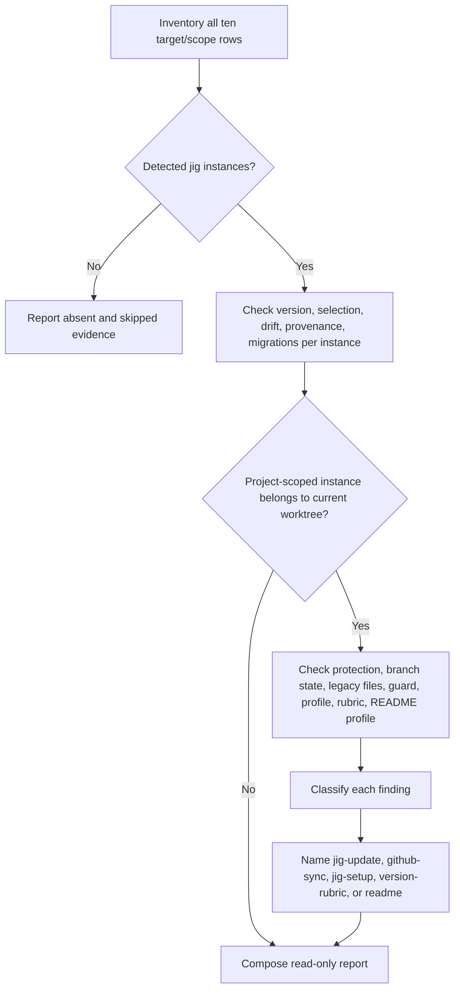

# jig Doctor

<!-- jig:skill-source-digest e83c9c4e5df46b3f7be0893d690cad1047cc0137 -->

[한국어](../../ko/skills/jig-doctor.md) · [Skill index](index.md)

## Overview

`jig-doctor` is the read-only health check for every detected Claude Code, Codex, and Antigravity installation across project and user scopes. It inventories first, evaluates every instance independently, then diagnoses repository state only when a project-scoped installation belongs to the current Git worktree.

## When to use

Use it after setup or update, when versions or skill selections look inconsistent, before a release, or when protection, the local guard, profile, rubric, README profile, migration, or legacy state is uncertain. It never repairs findings; each finding names the owning skill.

## Invocation

- Claude Code: `/jig:jig-doctor`
- Codex and Antigravity: `jig-doctor`

## Inventory model

The inventory covers ten independent rows: Claude Code plugin project/local/user/managed, Claude standalone project/user, Codex project/global, and Antigravity project/global. A rules file counts only when it contains the jig managed block. A standalone root counts only when ledger/provenance or the conservative legacy identity proves ownership.

Standalone states include `verified`, `legacy-unledgered`, `ledger-invalid`, `partial`, `provenance-conflict`, `non-owned`, `source-mirror`, and `absent`. A user-authored `non-owned` root is not a jig defect.

## Workflow

Plugin payloads are host-managed and are not compared with file payload tags. Versioned file installations are compared against the matching release's `dist/files.tsv`; missing files, drift, and leftovers are reported separately.

## Reads and external checks

The skill reads plugin settings, standalone ledgers/provenance, managed blocks and version stamps, release metadata, payload catalogs, Git branch relations, protection/rulesets, `.git/hooks/pre-push`, local Git config, `.jig/versioning.md`, legacy release files, labels, and `.bak` leftovers. It may call `gh`, `git`, and the shipped standalone inspector, all read-only.

## Safety and failure behavior

- Never modify files, settings, branches, labels, plugins, or installations.
- Never treat `.jig/` project content or an ordinary user skill as payload drift.
- If a tool is unavailable, run independent checks and mark only dependent checks skipped.
- Repository checks do not run for user/global-only installations in an unrelated directory.
- Protection `403` or a recorded skip is informational; it is not automatically a defect.

## Outputs and fix ownership

The report covers inventory, per-instance version/selection/drift/provenance, pending migrations, optional protection, branch divergence, legacy leftovers, local guard, profile, rubric, README profile, and recommended actions. Payload/version/provenance findings belong to `jig-update`; protection/guard to `github-sync`; profile to `jig-setup`; rubric to `version-rubric`; README profile to `readme`.

Both project-owned files under `.jig/` are read the same way: resolve the path, report the source, name which sections are present, and check that the file is committed — an uncommitted one applies on one machine and nowhere else. Neither is compared against any payload, and an absent file is a normal state rather than a defect. A missing rubric still matters because `github-release` stops without one; a missing README profile only means the `readme` skill falls back to its generic defaults. Branch divergence requires manual reconciliation and never a force push.

## Related skills

- [`jig-update`](jig-update.md) repairs supported installation findings.
- [`github-sync`](github-sync.md) fixes branch protection and the local guard.
- [`jig-setup`](jig-setup.md) repairs profile or incomplete setup.
- [`version-rubric`](version-rubric.md) owns rubric creation and repair.
- [`readme`](readme.md) owns the README profile this skill reports.

## Source

- [`skills/jig-doctor/SKILL.md`](../../../skills/jig-doctor/SKILL.md)
- [`inspect-claude-standalone.sh`](../../../skills/jig-doctor/scripts/inspect-claude-standalone.sh)
