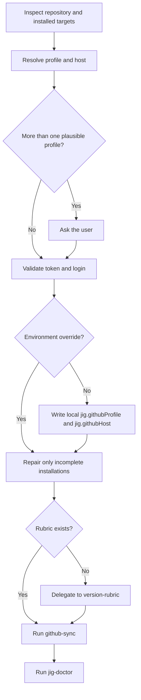

# jig Setup

[한국어](../../ko/skills/jig-setup.md) · [Skill index](index.md) · [Documentation home](../index.md)

## Overview

`jig-setup` finishes a repository installation. It binds the checkout to one authenticated GitHub CLI profile without changing the globally active `gh` account, repairs an incomplete target, settles the version rubric, converges repository settings, and finishes with a read-only diagnosis.

## When to use

Use it after installing jig, when a repository has no `jig.githubProfile`, when several GitHub accounts make the correct identity ambiguous, or when the installed target is incomplete. It does not publish releases, force branch changes, or own the rubric text.

## Invocation

- Claude Code: `/jig:jig-setup`
- Codex and Antigravity: `jig-setup`
- Natural language: "Finish jig setup for this repository using profile `your-account`."

## Inputs and prerequisites

- A Git worktree with jig installed for at least one supported target
- GitHub CLI when repository convergence is required
- Profile resolution order: explicit input, `JIG_GITHUB_PROFILE`, local `jig.githubProfile`, then an authenticated login matching the repository owner
- Host resolution order: `JIG_GITHUB_HOST`, local `jig.githubHost`, then `github.com`

An environment variable is session-only. Otherwise the selected login and host are written to local Git config; credentials remain in the GitHub CLI credential store.

## Workflow

For Claude Code, repair means ensuring `jig@jig` is enabled at the detected scope. For Codex and Antigravity, it reruns the installer only when the managed stamp or `jig-setup` payload is incomplete, preserving the stamped selection.

## Reads and writes

It reads plugin/settings inventory, `AGENTS.md`, `GEMINI.md`, Git config, GitHub identity, and `.jig/versioning.md`. It may write local `jig.githubProfile` and `jig.githubHost`, repair installed jig payloads through the supported installer, and delegate repository settings to `github-sync`. It never stores an OAuth token in the repository or Git config.

## Decision points and safety

- Ask when multiple profiles remain plausible.
- An unauthenticated requested profile may require interactive `gh auth login`.
- Never call `gh auth switch`, modify shell startup files, expose tokens, edit the rubric directly, force push, delete branches, or create a release.
- Preserve modified user files and use installer backup behavior for repairs.

## Outputs

The final report names the target and scope, profile source and login, host, changed local config, rubric source and kind, repair status, and the results from `github-sync` and `jig-doctor`.

## Related skills

- [`version-rubric`](version-rubric.md) owns `.jig/versioning.md`.
- [`rubric-scan`](rubric-scan.md) recommends a project-specific rubric when needed.
- [`github-sync`](github-sync.md) owns branch convergence and protection.
- [`jig-doctor`](jig-doctor.md) verifies the finished state without changing it.

## Source

- [`skills/jig-setup/SKILL.md`](../../../skills/jig-setup/SKILL.md)
