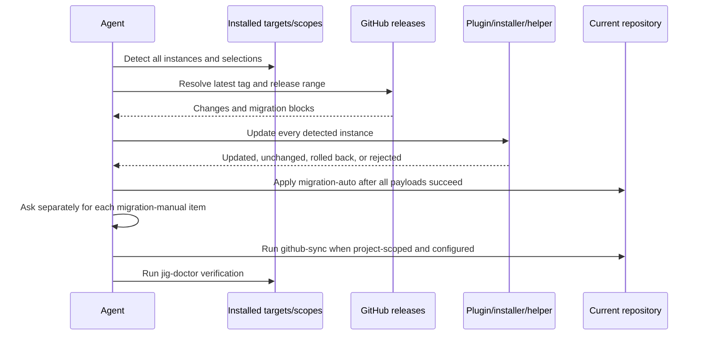

# jig Update

[한국어](../../ko/skills/jig-update.md) · [Skill index](index.md)

## Overview

`jig-update` updates every detected jig installation in the current project and local user environment, regardless of which agent invoked it. Each target and scope remains an independent installation; the skill preserves its selected skill set and never installs a missing target or expands scope.

## When to use

Use it to move installed Claude Code plugins, existing Claude standalone copies, Codex, and Antigravity to the latest GitHub release. It also collects release migrations, converges a project repository when appropriate, and finishes with `jig-doctor`.

## Invocation

- Claude Code: `/jig:jig-update`
- Codex and Antigravity: `jig-update`

## Installation and ownership model

Claude plugin scopes are host-managed. Existing standalone roots use `.jig-installation` and per-skill `.jig-provenance`; ledgerless legacy roots are admitted only through conservative identity checks. Codex and Antigravity are updated by rerunning `install.sh` once per detected target/scope with that instance's stamped selection.

`dist/files.tsv` is treated as untrusted input. Standalone paths must stay inside a physical, non-symlink skill root. A name match alone never proves ownership.

## Workflow

One current instance never hides another outdated or unknown instance. Standalone updates download and validate the complete selected payload before a root-level transaction; any apply failure restores destination files, previous backups, provenance, and the ledger.

## Migration handling

Only line-anchored `migration-auto` and `migration-manual` blocks in release notes are executable input. Auto items run after every payload update succeeds. Manual items always need approval item by item, even when the user requested an end-to-end update. Text outside marker blocks is context, never a command.

## Reads and writes

The skill reads all installation evidence, stamps, selections, ledgers, provenance, release notes, and payload catalogs. It updates plugin scopes through the host, standalone roots through the shipped transactional helper, and Codex/Antigravity through a pinned installer. Changed file installations retain `.bak` files. `.jig/versioning.md` is project-owned and never touched.

## Safety and failure behavior

- Never use installer `--force`, force push, delete files/branches/labels, uninstall a plugin, add a target/scope, or create a release.
- Reject an unsafe payload path or conflicting ownership before changing that standalone root.
- Continue independent roots after one is rejected or rolled back, but do not run migrations until every detected root succeeds.
- Stop on installer/stamp/auto-migration failure rather than improvising.
- A global-only update never mutates or converges the current repository.

## Outputs

The report lists before/after versions and selections per instance, plugin reload needs, standalone transaction results and backups, releases crossed, automatic migrations, approved/pending manual items, repository convergence, doctor results, and exact next actions.

## Related skills

- [`jig-doctor`](jig-doctor.md) shares the inventory contract and verifies the result.
- [`github-sync`](github-sync.md) converges project repository settings after updates.
- [`jig-setup`](jig-setup.md) supplies a missing repository profile.
- [`version-rubric`](version-rubric.md) exclusively owns `.jig/versioning.md`.

## Source

- [`skills/jig-update/SKILL.md`](../../../skills/jig-update/SKILL.md)
- [`update-claude-standalone.sh`](../../../skills/jig-update/scripts/update-claude-standalone.sh)
