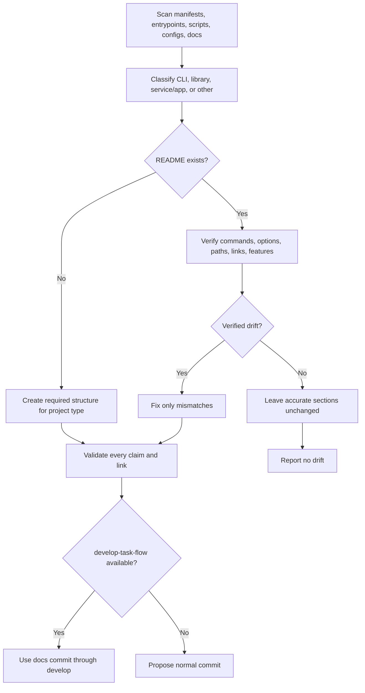

# README Skill

[한국어](../../ko/skills/readme.md) · [Skill index](index.md)

## Overview

`readme` creates a missing README or checks an existing README against repository evidence and fixes only verified drift. It classifies the project before choosing a layout and preserves the repository's existing language.

## When to use

Use it when starting documentation, after commands/options/paths changed, or when README claims may no longer match the implementation. It is not a generic marketing writer: unverifiable claims are omitted and reported.

## Invocation

- Claude Code: `/jig:readme`
- Codex and Antigravity: `jig-readme`

## Workflow

CLI projects add commands/options, libraries add an API summary and example, and services/apps add development/production startup and required environment variables.

## Reads and writes

It reads manifests, lock files, entrypoints, CLI definitions, scripts, service configs, docs, and examples. It writes only README content justified by those files. On existing READMEs it first collects a drift list and leaves still-accurate sections untouched.

## Accuracy, layout, and safety

- Commands must exist in code or build/install files; every local link target must exist.
- Do not invent badges, integrations, options, or features.
- Keep identifier-table descriptions short enough that names do not wrap; use lists when explanations are long.
- Preserve existing language. A new README follows repository language, defaulting to English.
- When `develop-task-flow` exists, merge through a `docs:` squash commit on `develop`.

## Outputs

The report states project type, create/update path, detected drift and fixes, and claims left out because they could not be verified.

## Related skills

- [`develop-task-flow`](develop-task-flow.md) owns the branch/merge path for README changes.
- [`jig-doctor`](jig-doctor.md) can reveal installation facts that README usage should describe accurately.

## Source

- [`skills/readme/SKILL.md`](../../../skills/readme/SKILL.md)
