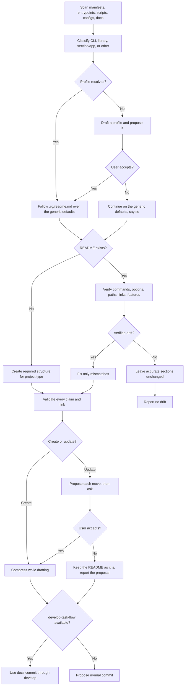

# README Skill

<!-- jig:skill-source-digest 146d9e857d0230dd6db022b80f8b28db1a654e90 -->

[한국어](../../ko/skills/readme.md) · [Skill index](index.md)

## Overview

`readme` creates a missing README or checks an existing README against repository evidence and fixes only verified drift. It classifies the project, reads the repository's own README profile at `.jig/readme.md` when one exists, keeps the result short by moving facts stated in more than one place into the detail docs, and preserves the repository's existing language.

## When to use

Use it when starting documentation, after commands/options/paths changed, when README claims may no longer match the implementation, or when a README has grown until the same fact appears in several sections. It is not a generic marketing writer: unverifiable claims are omitted and reported.

## Invocation

- Claude Code: `/jig:readme`
- Codex and Antigravity: `jig-readme`

## Workflow

CLI projects add commands/options, libraries add an API summary and example, and services/apps add development/production startup and required environment variables.

## The README profile

Two repositories of the same project type still write their READMEs differently: one keeps a translated mirror, another moves installation into a guide, a third has a table convention its contributors already follow. None of that can be scanned for — they are decisions — so they are recorded once and read on every later run.

Resolution order: `JIG_README_PROFILE`, then `git config --local --get jig.readmeProfile`, then `.jig/readme.md`. A resolved profile **overrides the generic section layout and language rules**; anything it does not mention falls back to them.

The file has four sections and records decisions only — no thresholds and no check list, because README quality stays a judgment the skill makes with the repository in front of it:

| Section | What it settles |
|---|---|
| `## Languages` | canonical file, mirror file, how they stay paired |
| `## Sections` | the section order this repository uses |
| `## Detail Docs` | what leaves the README and which doc receives it |
| `## Conventions` | table style, claim discipline, asset paths |

When no profile resolves, the skill drafts one from the scan and proposes it; `.jig/readme.md` is written only after the user accepts. Declining is a normal outcome — the run continues on the generic defaults and the report says so. An existing profile is never overwritten without confirmation, and nothing else under `.jig/` is touched: `version-rubric` owns `.jig/versioning.md`.

## Compression

Length is treated as a symptom rather than a target. A long README is usually one fact written in several places, so the rule is **move, do not delete**: the fact stays where a reader arrives at it first and the copies go to the detail doc that already covers the subject. There is no line count to meet — a library README carrying the API examples it genuinely needs is not too long, and a short README that says the same thing twice is still wrong.

The rest of the pass is about what earns its place near the top:

- the introduction says what becomes easier, not which features exist, ordered strongest evidence first, with any surrounding prose in that same order
- a claim the repository cannot demonstrate is left out rather than softened, and the condition under which the value appears is stated so the wrong reader can rule the project out quickly
- roadmaps and design records move to the documentation home; they are not read before installing
- build and validation commands fold into a `
` block or a contributing doc
- command blocks differing by one argument merge into one
- past about four sections, a one-line link row goes under the title

On an existing README none of this happens silently. The skill names each repeated fact, where it would move, and asks first; a declined proposal is still reported.

## Reads and writes

It reads manifests, lock files, entrypoints, CLI definitions, scripts, service configs, docs, and examples. It writes only README content justified by those files. On existing READMEs it first collects a drift list and leaves still-accurate sections untouched.

## Accuracy, layout, and safety

- Commands must exist in code or build/install files; every local link target must exist.
- Do not invent badges, integrations, options, or features.
- Keep identifier-table descriptions short enough that names do not wrap; use lists when explanations are long.
- Never restructure a published README without asking: the compression pass proposes moves on the update path and applies them only after the user accepts.
- Write `.jig/readme.md` only on acceptance, never as a side effect of an ordinary README update, and never over an existing profile without confirmation.
- Preserve existing language. A new README follows repository language, defaulting to English.
- When `develop-task-flow` exists, merge through a `docs:` squash commit on `develop`.

## Outputs

The report states project type, the README profile and where it resolved from (or that it was proposed and declined), create/update path, detected drift and fixes, the compression proposal with each repeated fact and its destination, whether the user accepted it, and claims left out because they could not be verified.

## Related skills

- [`develop-task-flow`](develop-task-flow.md) owns the branch/merge path for README changes.
- [`jig-doctor`](jig-doctor.md) can reveal installation facts that README usage should describe accurately.
- [`version-rubric`](version-rubric.md) owns the other project-owned file under `.jig/`; the two never write each other's.

## Source

- [`skills/readme/SKILL.md`](../../../skills/readme/SKILL.md)
