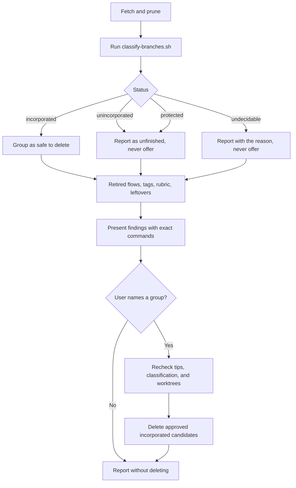

# Repo Hygiene

<!-- jig:skill-source-digest 3d10dfe3494b3728e563a577fae9e424368ff46b -->

[한국어](../../ko/skills/repo-hygiene.md) · [Skill index](index.md)

## Overview

`repo-hygiene` audits and clears the debris a long-running jig repository accumulates: task branches whose work already shipped, branches left from retired flows, stale remote-tracking refs, tag and release mismatches, an unreachable rubric, and installer leftovers. It reports every finding and deletes only what the user names.

## When to use

Use it when a repository has been worked through jig for a while and the branch list, tags, or leftovers have grown noisy. For the state of the jig installation rather than the repository, use `jig-doctor`.

## Invocation and inputs

- Claude Code: `/jig:repo-hygiene`
- Codex: `jig:repo-hygiene`
- Antigravity: `jig-repo-hygiene`
- Inputs: the local clone, `origin`, the resolved rubric path, and an authenticated GitHub profile for the tag/release comparison

## Why merged branches look unmerged

`develop-task-flow` finishes with `git merge --squash`, so a task branch tip never becomes an ancestor of `develop`. `git branch --merged develop` therefore finds almost nothing while `--no-merged` lists work that shipped months ago.

A plain diff does not settle it either. `git diff develop...<branch>` compares the merge base with the branch, so it still shows the branch's own contribution after a squash merge; `git diff develop..<branch>` compares the two tips, so one later unrelated commit on `develop` makes a finished branch look unfinished.

Run `sh scripts/classify-branches.sh [--base develop] [--history-limit 200] [<local-branch>...]` relative to the skill directory. Its TSV output is status, branch, detail. Only `incorporated` may be offered for explicitly approved deletion.

- `incorporated`: every task-changed path matches the base's current content, type, and mode, or the task diff is empty. Unrelated base paths are ignored. This proves content equivalence, not merge history.
- `unincorporated`: a differing path remains at the fork version or an earlier task version, and bounded post-fork history never held the latest task version. Details also count uncertain paths.
- `undecidable`: historical equality followed by differing content (including extensions and full/partial reverts), independent edits, or incomplete history. Past equality never makes a differing path deletable.
- `protected`: `main`, `develop`, the base, or current branch, including fully qualified local names.

Mode/type changes are compared. Renames are deletion plus addition, so a copy alone does not count. Quoted filenames (control characters or non-ASCII), missing/multiple merge bases, and nonlocal branch arguments are undecidable. Differing paths with shallow or truncated history remain uncertain. Git errors never count as an empty diff. The default history bound is 200 commits per differing path; the script reads committed trees and never deletes.

## Workflow

## Reads and writes

It reads branches, refs, tags, GitHub releases, the rubric path, and the working tree. Its only writes are deletions the user confirmed, plus the prune that `git fetch --prune` performs on remote-tracking refs. It never modifies tracked files.

## Stop conditions and safety

- A list is not consent: nothing is deleted until the user names the group.
- `main`, `develop`, and the current branch are never touched.
- Only a branch the classifier reported `incorporated` is ever deleted or offered. `unincorporated`, `undecidable`, and `protected` branches are reported and left alone, and an undecidable branch is never described as probably safe.
- Remote branches, tags, and GitHub releases are never deleted; mismatches are reported for a human.
- `.jig/` is never touched, and no command that rewrites history is run.

- Before deleting, reclassify the approved candidates and recheck tips and all worktrees. A changed tip needs a new decision; checked-out branches are excluded. Retired-flow membership alone is not deletion approval.

## Outputs

One check outranks the rest: when `git merge-base --is-ancestor origin/main origin/develop` fails, a hotfix landed on `main` and never returned to `develop`, so `github-release` cannot promote until `git merge main` runs. That is reported first.

The report groups branches by shipped, unfinished, undecidable with the reason, and retired-flow, then names what was deleted, how many remote-tracking refs were pruned, tag/release mismatches, whether the rubric is committed, remaining leftovers, and any check that was skipped with the reason.

## Related skills

- [`jig-doctor`](jig-doctor.md) diagnoses the jig installation; this skill cleans the repository.
- [`develop-task-flow`](develop-task-flow.md) creates the task branches this skill later clears.
- [`github-release`](github-release.md) creates the tags this skill compares with releases.
- [`version-rubric`](version-rubric.md) owns the rubric file that must be committed.

## Source

- [`skills/repo-hygiene/SKILL.md`](../../../skills/repo-hygiene/SKILL.md)
- [`classify-branches.sh`](../../../skills/repo-hygiene/scripts/classify-branches.sh), the branch verdict the skill reads
