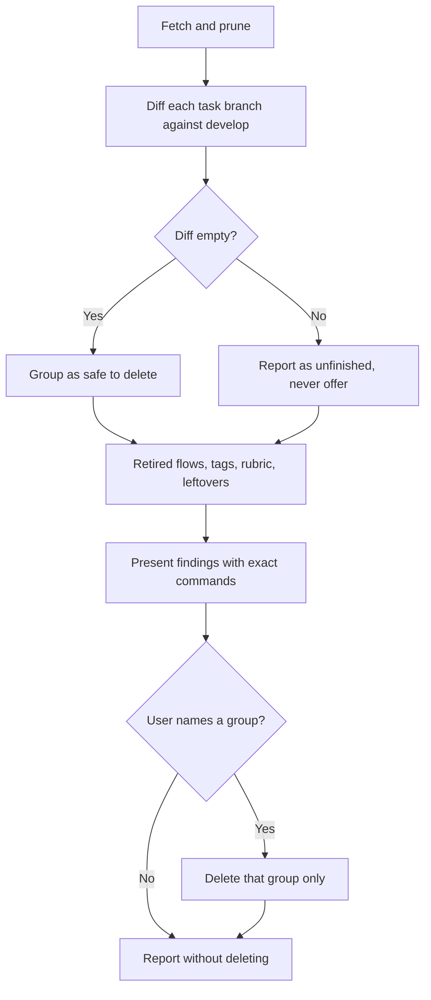

# Repo Hygiene

<!-- jig:skill-source-digest 0f13f5a3e02c019f88c231b174741215c66e9fc7 -->

[한국어](../../ko/skills/repo-hygiene.md) · [Skill index](index.md)

## Overview

`repo-hygiene` audits and clears the debris a long-running jig repository accumulates: task branches whose work already shipped, branches left from retired flows, stale remote-tracking refs, tag and release mismatches, an unreachable rubric, and installer leftovers. It reports every finding and deletes only what the user names.

## When to use

Use it when a repository has been worked through jig for a while and the branch list, tags, or leftovers have grown noisy. For the state of the jig installation rather than the repository, use `jig-doctor`.

## Invocation and inputs

- Claude Code: `/jig:repo-hygiene`
- Codex and Antigravity: `jig-repo-hygiene`
- Inputs: the local clone, `origin`, the resolved rubric path, and an authenticated GitHub profile for the tag/release comparison

## Why merged branches look unmerged

`develop-task-flow` finishes with `git merge --squash`, so a task branch tip never becomes an ancestor of `develop`. `git branch --merged develop` therefore finds almost nothing while `--no-merged` lists work that shipped months ago.

The skill classifies by content instead:

```bash
git diff --quiet develop...<branch>
```

An empty diff means everything on the branch is already reachable from `develop` regardless of SHAs, which is the safe signal. A non-empty diff means the branch still holds something, so it is reported as unfinished and never offered for deletion.

## Workflow



## Reads and writes

It reads branches, refs, tags, GitHub releases, the rubric path, and the working tree. Its only writes are deletions the user confirmed, plus the prune that `git fetch --prune` performs on remote-tracking refs. It never modifies tracked files.

## Stop conditions and safety

- A list is not consent: nothing is deleted until the user names the group.
- `main`, `develop`, and the current branch are never touched.
- A branch with a non-empty diff against `develop` is never deleted or offered.
- Remote branches, tags, and GitHub releases are never deleted; mismatches are reported for a human.
- `.jig/` is never touched, and no command that rewrites history is run.

## Outputs

One check outranks the rest: when `git merge-base --is-ancestor origin/main origin/develop` fails, a hotfix landed on `main` and never returned to `develop`, so `github-release` cannot promote until `git merge main` runs. That is reported first.

The report groups branches by shipped, unfinished, and retired-flow, then names what was deleted, how many remote-tracking refs were pruned, tag/release mismatches, whether the rubric is committed, remaining leftovers, and any check that was skipped with the reason.

## Related skills

- [`jig-doctor`](jig-doctor.md) diagnoses the jig installation; this skill cleans the repository.
- [`develop-task-flow`](develop-task-flow.md) creates the task branches this skill later clears.
- [`github-release`](github-release.md) creates the tags this skill compares with releases.
- [`version-rubric`](version-rubric.md) owns the rubric file that must be committed.

## Source

- [`skills/repo-hygiene/SKILL.md`](../../../skills/repo-hygiene/SKILL.md)
