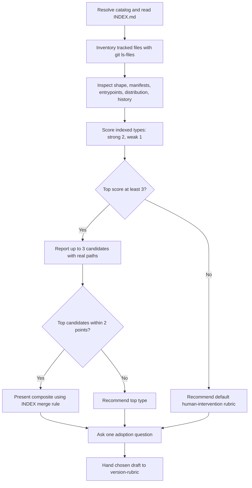

# Rubric Scan

[한국어](../../ko/skills/rubric-scan.md) · [Skill index](index.md) · [Version rubric](../version-rubric.md)

## Overview

`rubric-scan` is a read-only classifier. It examines tracked repository evidence, scores project types from the shipped catalog, reports up to three evidence-backed candidates, and hands the chosen draft to `version-rubric`. It never writes `.jig/versioning.md`.

## When to use

Run it before creating a rubric when the project type is unclear, or after the project changed enough that its current grading axis no longer fits what it ships.

## Invocation and catalog

- Claude Code: `/jig:rubric-scan`
- Codex and Antigravity: `jig-rubric-scan`
- Catalog resolution: `JIG_RUBRIC_CATALOG`, Claude plugin, project install, jig source repository, then user install

The scan reads `rubrics/INDEX.md` first for types, detection signals, scoring, and merge rules. It reads only candidate bodies, never every rubric file. If the catalog is absent, it recommends the default through `version-rubric` rather than inventing a type.

## Workflow

Only tracked files are evidence. Dependency names, published entrypoints, deployment/install configuration, and actual release history are stronger than incidental scripts or untracked output.

## Reads and outputs

It reads tracked file names and relevant manifests, entrypoints, distribution configuration, recent commits/tags, the catalog index, and candidate rubric bodies. The report includes catalog source, tracked-file shape, shipped artifact, ranked type/score/evidence paths, recommendation, grading axis, draft path, and next action.

## Safety

- Never write, move, delete, install, build, test, or access the network to classify the project.
- Never read secret contents or files outside the repository.
- Never invent an unindexed type or overwrite an existing rubric through handoff.
- Catalog drafts grade SemVer consumer compatibility; the default grades human intervention. State when adoption replaces the current axis.
- Release grading and notes belong to `github-release`.

## Related skills

- [`version-rubric`](version-rubric.md) owns the selected draft and file write.
- [`github-release`](github-release.md) later consumes the settled rubric.

## Source

- [`skills/rubric-scan/SKILL.md`](../../../skills/rubric-scan/SKILL.md)
- [Rubric catalog](../../../skills/version-rubric/rubrics/INDEX.md)
