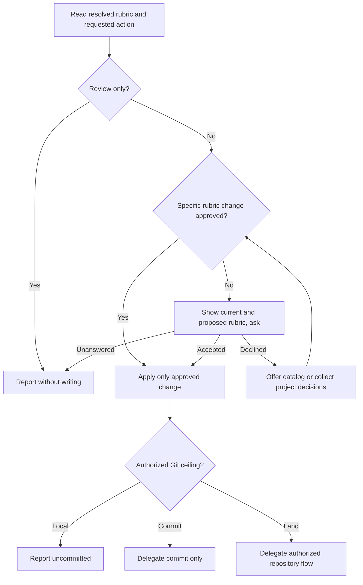

# Version Rubric

<!-- jig:skill-source-digest af9061e8cf58f4efbba7e0f7ea0b9bf09e6dc67b -->

[한국어](../../ko/skills/version-rubric.md) · [Skill index](index.md) · [Rubric contract](../version-rubric.md)

## Overview

`version-rubric` exclusively creates, reviews, re-settles, or edits the project-owned version policy resolved from `JIG_VERSION_RUBRIC`, local `jig.versionRubric`, or `.jig/versioning.md`. It never runs a release.

## When to use

Use it when the rubric is missing, when reviewing how the project grades `patch`/`minor`/`major`, when adopting a catalog type, editing one grade, resetting to the default, or explicitly converting legacy Korean section titles.

## Invocation and file contract

- Claude Code: `/jig:version-rubric`
- Codex: `jig:version-rubric`
- Antigravity: `jig-version-rubric`
- Required sections: `## Decision Order`, `## Grade Definitions`
- Optional: `## Hard Rules`, `## Interface Paths`, `## Hotfix Triggers`, `## Release Notes`, `## Version Format`, `## Pre-Release Checks`

`## Interface Paths` maps path globs to the lowest grade a change under them can be, so `develop-task-flow` and `github-release` can compute a starting grade from `git diff --name-only` instead of reading a prose interface list by eye. First matching row wins, and the floor it produces is advisory: a release may land below it with a recorded reason. Every catalog draft ships this table with the globs its type conventionally uses, so adopting a type means checking those globs against the real tree; the default rubric ships none and gets one only when the user asks.

Legacy Korean titles remain valid but must not be mixed with English titles. The `> Basis:` line records default adoption, catalog type, or project-specific origin. The file must be committed so clones and CI grade the same way.

## Workflow

The default grades on human intervention. Catalog drafts grade SemVer consumer compatibility. They are alternative axes and must be adopted whole, not mixed question by question.

## Reads and writes

It reads the resolved rubric, Git state, the catalog index and one relevant draft when needed, and task-relevant repository context. It writes only the approved rubric change. Review is read-only. Git operations are delegated to an adopted `develop-task-flow` within current limits and explicitly approved standing policy: local changes remain uncommitted, commit-only scope excludes landing, and already authorized landing needs no repeated approval. The rubric skill itself does not manage branches, tags, protection, or releases; its catalog remains shipped payload.

## Decision points and safety

- Show the existing rubric and require an explicit decision for the specific replacement; reuse that decision when already given.
- Silence is never approval. An unanswered create/re-set question means nothing is written: the default is reported as proposed and the run stops. The default is written without a fresh answer only when the request already asked for it, and replacement of an existing rubric likewise requires an explicit decision. A generic setup request or silence grants neither.
- Preserve the user's language and vocabulary; rephrasing changes future grading.
- Never silently translate/retitle, create `.bak`, modify catalog files, grade a release, touch GitHub settings, or force a commit.
- Inspect and preserve untracked/uncommitted work; ask before discarding it outside the approved replacement.

## Outputs

The report includes path/source, basis, title spelling, three grade questions, action taken, draft source, commit status, and next action.

## Related skills

- [`rubric-scan`](rubric-scan.md) recommends a catalog type without writing.
- [`github-release`](github-release.md) reads the settled rubric.
- [`jig-setup`](jig-setup.md) delegates missing rubric creation here.
- [`jig-doctor`](jig-doctor.md) diagnoses missing, broken, or uncommitted rubrics.

## Source

- [`skills/version-rubric/SKILL.md`](../../../skills/version-rubric/SKILL.md)
- [Rubric catalog](../../../skills/version-rubric/rubrics/INDEX.md)
- [Human-readable contract](../version-rubric.md)
