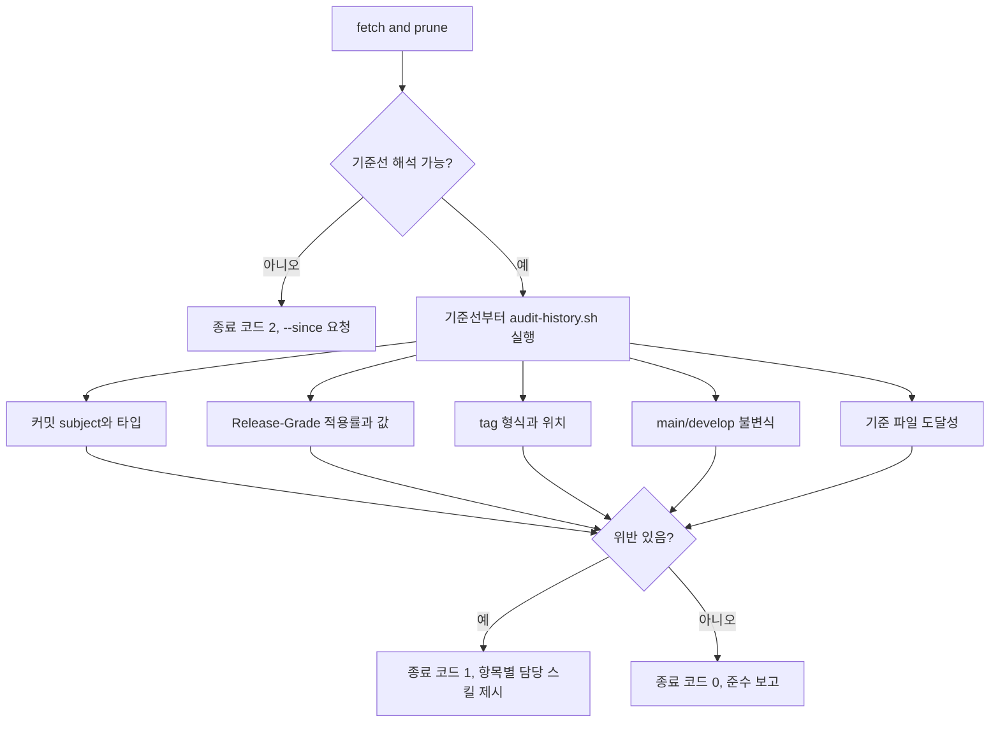

# Conformance Audit

<!-- jig:skill-source-digest cd76b0cdee0d2319d7769f4526b936dd94ed6c5e -->

[English](../../en/skills/conformance-audit.md) · [스킬 목록](index.md)

## 개요

`conformance-audit`은 저장소의 이력이 실제로 jig 절차를 따랐는지 사후에 확인합니다. 커밋 subject, `Release-Grade` trailer, tag, `main`과 `develop`의 관계를 읽어 위반과 참고 사항을 보고합니다. 아무것도 쓰지 않으며 위반을 찾으면 0이 아닌 코드로 종료하므로 CI에서 게이트로 쓸 수 있습니다.

## 사용 시점

기존 저장소에 jig를 도입할 때, 릴리즈 직전에, 또는 CI에서 주기적으로 씁니다. push 가드는 잘못된 push를 그 순간에 막지만, 이미 반영된 것을 확인하는 수단은 이 스킬뿐입니다.

## 실행 방법과 입력

- Claude Code: `/jig:conformance-audit`
- Codex·Antigravity: `jig-conformance-audit`
- 입력: 로컬 clone, `origin`, tag 목록, 해석된 기준 파일 경로
- 선택: 기준선을 직접 지정하는 `--since <ref>`

## 기준선이 필요한 이유

오늘 jig를 설치한 저장소에는 다른 규칙으로 쓰인 이력이 이미 쌓여 있습니다. 그것까지 판정하면 첫날부터 저장소가 망가진 것으로 보고되고, 사용자는 도구를 무시하게 됩니다.

그래서 매 실행은 기준선을 먼저 정하고 그 이전은 판정하지 않습니다.

1. `--since <ref>`가 주어지면 그것
2. `.jig/versioning.md`를 추가한 커밋 — 저장소가 등급 계약을 채택한 지점
3. 가장 오래된 `vX.Y.Z` tag
4. 아무것도 해석되지 않으면 전체 이력으로 넘어가지 않고 사용법 오류로 중단

기준선과 그 출처는 모든 보고에 들어갑니다. 기준선 없이는 어떤 발견도 의미가 없기 때문입니다.

## 등급 누락의 비용

`develop-task-flow`는 병합 시점에 `Release-Grade` trailer를 기록하고, `github-release`는 릴리즈 범위에서 가장 높은 값을 절대 내리지 않는 하한으로 씁니다. 범위 안의 어느 커밋도 trailer를 갖지 않으면 그 조회는 빈 문자열을 돌려줍니다. 릴리즈는 실패하지도 경고하지도 않고, 참고값인 경로 하한만으로 판정합니다. 저장소는 아무 증상 없이 그 상태로 여러 버전을 내보낼 수 있습니다.

그래서 0%는 위반이고 부분 적용은 참고 사항입니다. 부분 적용은 이행 중인 저장소지만, 0%는 하한이 사라진 상태입니다.

## 검사 항목

| ID | 확인 대상 | 등급 |
|---|---|---|
| `subject-prefix` | 관습 타입이 없는 커밋 | 위반 |
| `subject-type` | 문서화된 일곱 타입 밖의 타입 | 참고 |
| `grade-coverage` | 릴리즈 범위에 `Release-Grade`가 하나도 없음 | 위반 |
| `grade-value` | 소문자 등급 한 줄이 아닌 trailer | 위반 |
| `tag-format` | `vX.Y.Z`를 벗어난 tag | 위반 |
| `tag-on-main` | `main`에서 도달할 수 없는 버전 tag | 위반 |
| `main-ancestry` | `main`이 `develop`의 조상이 아님 | 위반 |
| `main-lineage` | `develop`에서 도달할 수 없는 `main`의 커밋 | 위반 |
| `rubric-tracked` | 기준 파일이 없거나 추적·커밋되지 않음 | 참고 |

## 작업 흐름



## CI에서 실행

```bash
sh scripts/audit-history.sh --quiet
```

경로는 스킬 디렉터리 기준입니다. 종료 코드가 계약입니다: `0` 준수, `1` 위반 발견, `2` 사용법·환경 오류. 스크립트는 로컬 branch보다 `origin/<branch>`를 우선하므로 낡은 checkout이 판정을 바꾸지 않습니다.

## 읽기와 쓰기

커밋, trailer, tag, branch, 기준 파일 경로를 읽습니다. 작업 트리도 `.git`도 `.jig/`도 쓰지 않습니다. 산출물은 보고서와 종료 코드뿐입니다.

## 중단 조건과 안전 규칙

- 발견을 없애려고 이력을 다시 쓰지 않습니다. rebase, amend, filter-branch, force push 모두 하지 않습니다.
- 과거 커밋의 누락된 trailer는 복구 대상이 아닙니다. 관측된 사실로 기록하고 다음 작업부터 올바르게 기록합니다.
- tag와 GitHub release를 만들거나 옮기거나 지우지 않습니다.
- branch를 지우지 않습니다. 그건 [`repo-hygiene`](repo-hygiene.md)의 일입니다.
- 기준선을 해석할 수 없으면 전체 이력을 판정하지 않고 중단합니다.

## 산출물

보고서에는 기준선과 그 출처, 검사한 범위, 위반과 참고 사항 각 한 줄, 릴리즈 불변식 상태, 건너뛴 검사와 이유, 그리고 담당 스킬 이름으로 표현한 다음 조치가 들어갑니다.

## 관련 스킬

- [`develop-task-flow`](develop-task-flow.md)가 이 스킬이 검사하는 subject와 등급을 씁니다.
- [`github-release`](github-release.md)가 0% 적용률에서 조용히 비는 등급 하한을 소비합니다.
- [`hotfix-flow`](hotfix-flow.md) 8단계가 `main-ancestry`가 보고하는 불변식을 복구합니다.
- [`repo-hygiene`](repo-hygiene.md)는 clone 잔여물을 정리하고, 이 스킬은 이력을 판정하며 아무것도 지우지 않습니다.
- [`version-rubric`](version-rubric.md)이 `rubric-tracked`가 찾는 기준 파일을 소유합니다.

## 원본

- [`skills/conformance-audit/SKILL.md`](../../../skills/conformance-audit/SKILL.md)
