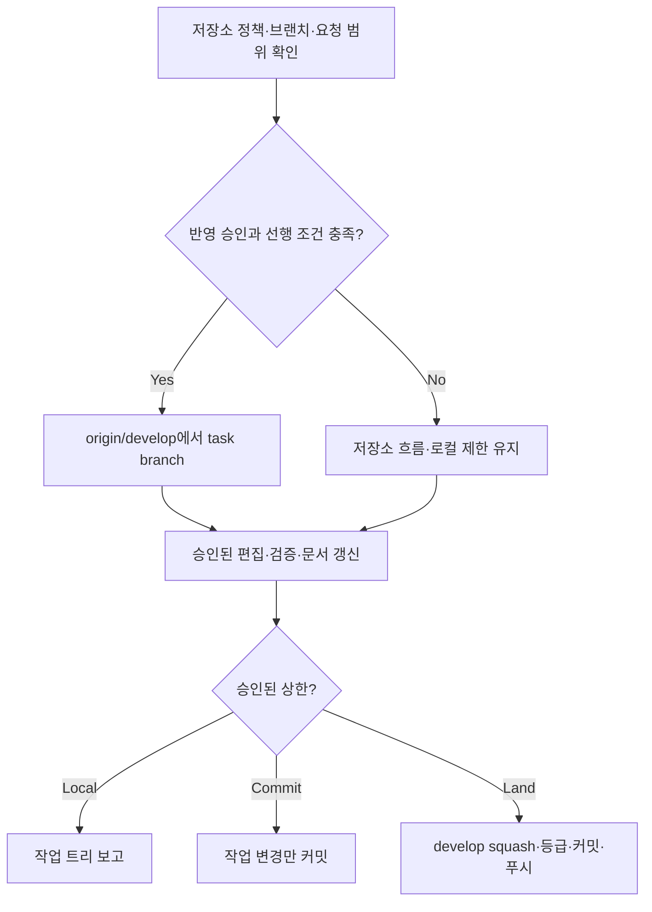

# Develop Task Flow

<!-- jig:skill-source-digest 87cce1e41e86b55f0f65a02a4903cd531a1a5aee -->

[English](../../en/skills/develop-task-flow.md) · [스킬 index](index.md)

## 개요

`develop-task-flow`는 jig 브랜치 모델을 채택한 저장소의 일반 구현 workflow입니다. task는 `origin/develop`에서 시작하고 하나의 유형별 work branch에서 완료한 뒤, local에서 `develop`으로 squash merge하고 PR 없이 push합니다.

## 사용 시점

code, config, docs, generated distribution, installer, workflow 변경에 사용합니다. release 발행에는 사용하지 않습니다. `github-release`는 이미 완료된 `develop`을 승격합니다.

**설치는 채택이 아닙니다.** 저장소 지침이나 사용자의 명시적 결정으로 운영 모델 채택을 확인합니다. 플러그인이나 브랜치가 존재하는 것만으로 추론하지 않습니다. `main`·`develop` 존재는 별도 선행 조건입니다. 채택 여부가 불명확하면 저장소 고유 흐름을 유지하며, 필요한 브랜치가 없으면 자동 생성하지 않고 보고합니다.

## 실행 범위

수정·검증, 커밋, 병합·푸시, 릴리즈는 별도 단계입니다. 현재 요청의 로컬·커밋 금지·푸시 금지 제한이 우선하고, 검토만 요청하면 읽기 전용입니다. 구현 요청은 편집·검증을 승인하며 커밋·반영은 현재 요청 또는 이미 명시적으로 승인된 저장소 정책에 따릅니다. 기존 승인은 매번 다시 묻지 않습니다. 릴리즈에는 별도 명시적 요청이 필요합니다.

`readme`·`version-rubric` 등 호출 스킬도 같은 상한을 전달합니다. 위임으로 Git 실행 권한이 늘어나지 않으며 새 설정 플래그도 만들지 않습니다.

## 실행 방법과 branch 모델

- Claude Code: `/jig:develop-task-flow`
- Codex: `jig:develop-task-flow`
- Antigravity: `jig-develop-task-flow`
- `feature/<slug>`: 사용자 기능
- `fix/<slug>`: bug, regression, security 수정
- `chore/<slug>`: tooling, docs, refactor, config, automation

## 작업 흐름

squash commit이 release note의 원천입니다. subject는 conventional prefix를 사용하고, body는 저장소 언어의 사용자 관점 bullet을 담은 뒤 `Release-Grade: patch|minor|major` trailer로 끝납니다.

등급 판정은 release 시점이 아니라 병합 시점에 합니다. 이 자리에는 diff와 test 결과가 아직 남아 있기 때문입니다. 등급은 `JIG_VERSION_RUBRIC`, `jig.versionRubric`, `.jig/versioning.md` 순으로 해석한 프로젝트 rubric을 이 task의 변경 경로에만 적용해 정합니다. rubric에 `## Interface Paths` 표가 있으면 경로를 눈으로 판단하지 않고 표에서 바닥을 읽습니다. 바뀐 경로마다 처음 걸리는 행을 취하며, 이 바닥은 참고값입니다. 이후 `github-release`가 범위 안에 기록된 등급 중 가장 높은 값을 하한으로 삼습니다. rubric을 해석할 수 없으면 추측하지 않고 trailer를 생략합니다.

## 읽기·변경 범위

Git status, branch, remote, 저장소 지침, test, 관련 code·docs를 읽습니다. 요청된 파일 편집·검증을 수행하고, branch 생성·commit·squash·push는 승인된 범위 안에서만 진행합니다.

## 문서·안전 규칙

- 공개 workflow, installation, target, CLI output, usage가 바뀌면 README 두 언어를 갱신하고 긴 설명은 `docs/`로 분리합니다.
- 예시에는 일반 identity·path만 사용합니다.
- force push, hook bypass, branch 삭제, 일반 작업의 `main` push, 실패한 test 병합을 하지 않습니다.
- 관계없는 사용자 변경을 squash commit에 포함하지 않습니다.
- 작업에 필요한 파일 편집은 덮어쓰기가 아니라 작업 자체입니다. 수정된 파일이라는 이유만으로 다시 묻지 않습니다. 기존 diff를 읽고 보존하며 승인 범위 밖 사용자 내용을 잃게 할 때만 확인합니다.
- 되돌릴 수 있는 구현 선택은 여기서 판단합니다. 범위, 외부 동작, 되돌릴 수 없는 작업만 사용자에게 묻습니다.
- 사용자가 명시적으로 요청하지 않으면 work branch를 남겁니다.

## 결과물

실행이 취한 범위와 그 근거, branch(또는 만들지 않은 이유), 변경 파일, test, README·docs 상태, `develop`에 push한 squash subject, 기록한 `Release-Grade`와 판정 근거 질문, blocked command, 남은 작업을 보고합니다.

## 관련 스킬

- [`github-release`](github-release.md): 완료된 `develop` 승격
- [`readme`](readme.md): 저장소 사실 기반 README 갱신
- [`jig-doctor`](jig-doctor.md): 설치·branch 모델 진단

## 원본

- [`skills/develop-task-flow/SKILL.md`](../../../skills/develop-task-flow/SKILL.md)
