# Develop Task Flow

<!-- jig:skill-source-digest d576956bd11a64b2b0209f6a080fd74b389dd434 -->

[English](../../en/skills/develop-task-flow.md) · [스킬 index](index.md)

## 개요

`develop-task-flow`는 jig 저장소의 일반 구현 workflow입니다. 모든 task는 `origin/develop`에서 시작하고 하나의 유형별 work branch에서 완료한 뒤, local에서 `develop`으로 squash merge하고 PR 없이 push합니다.

## 사용 시점

code, config, docs, generated distribution, installer, workflow 변경에 사용합니다. release 발행에는 사용하지 않습니다. `github-release`는 이미 완료된 `develop`을 승격합니다.

## 실행 방법과 branch 모델

- Claude Code: `/jig:develop-task-flow`
- Codex·Antigravity: `jig-develop-task-flow`
- `feature/<slug>`: 사용자 기능
- `fix/<slug>`: bug, regression, security 수정
- `chore/<slug>`: tooling, docs, refactor, config, automation

## 작업 흐름

```mermaid
flowchart LR
    Inspect[status·origin·test 점검] --> Branch[origin/develop에서 유형별 branch 생성]
    Branch --> Implement[구현·관계없는 변경 보존]
    Implement --> Focused[focused test]
    Focused --> Broad[광범위 validation]
    Broad --> Docs{공개 동작 변경?}
    Docs -- Yes --> UpdateDocs[README 또는 상세 docs 갱신]
    Docs -- No --> Commit[task branch commit]
    UpdateDocs --> Commit
    Commit --> Refresh[develop --ff-only pull]
    Refresh --> Squash[task branch squash merge]
    Squash --> Grade[프로젝트 rubric으로 등급 판정]
    Grade --> Push[Release-Grade trailer 포함 commit 후 develop push]
```

squash commit이 release note의 원천입니다. subject는 conventional prefix를 사용하고, body는 저장소 언어의 사용자 관점 bullet을 담은 뒤 `Release-Grade: patch|minor|major` trailer로 끝납니다.

등급 판정은 release 시점이 아니라 병합 시점에 합니다. 이 자리에는 diff와 test 결과가 아직 남아 있기 때문입니다. 등급은 `JIG_VERSION_RUBRIC`, `jig.versionRubric`, `.jig/versioning.md` 순으로 해석한 프로젝트 rubric을 이 task의 변경 경로에만 적용해 정합니다. 이후 `github-release`가 범위 안에 기록된 등급 중 가장 높은 값을 하한으로 삼습니다. rubric을 해석할 수 없으면 추측하지 않고 trailer를 생략합니다.

## 읽기·변경 범위

Git status, branch, remote, 저장소 지침, test, 관련 code·docs를 읽습니다. task branch를 생성하고 task 범위 파일만 변경하며, validation, task commit, final squash commit, `develop` push를 수행합니다.

## 문서·안전 규칙

- 공개 workflow, installation, target, CLI output, usage가 바뀌면 README 두 언어를 갱신하고 긴 설명은 `docs/`로 분리합니다.
- 예시에는 일반 identity·path만 사용합니다.
- force push, hook bypass, branch 삭제, 일반 작업의 `main` push, 실패한 test 병합을 하지 않습니다.
- 관계없는 사용자 변경을 squash commit에 포함하지 않습니다.
- 사용자가 명시적으로 요청하지 않으면 work branch를 남겁니다.

## 결과물

branch, 변경 파일, test, README·docs 상태, `develop`에 push한 squash subject, 기록한 `Release-Grade`와 판정 근거 질문, blocked command, 남은 작업을 보고합니다.

## 관련 스킬

- [`github-release`](github-release.md): 완료된 `develop` 승격
- [`readme`](readme.md): 저장소 사실 기반 README 갱신
- [`jig-doctor`](jig-doctor.md): 설치·branch 모델 진단

## 원본

- [`skills/develop-task-flow/SKILL.md`](../../../skills/develop-task-flow/SKILL.md)
