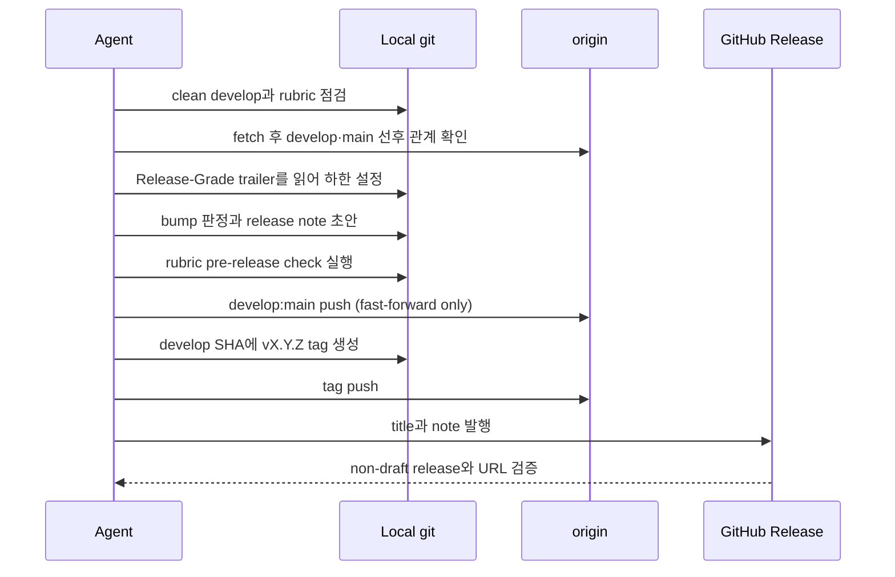

# GitHub Release

<!-- jig:skill-source-digest 05ff8c6611ecd7ce18ef9311279fa09b1838350c -->

[English](../../en/skills/github-release.md) · [스킬 index](index.md) · [버전 판정 기준](../version-rubric.md)

## 개요

`github-release`는 이미 완료된 `develop` 상태를 발행합니다. 프로젝트 자체 rubric으로 release 등급을 판정하고, squash commit으로 note를 쓰고, `develop`을 `main`으로 fast-forward한 뒤 정확한 commit에 tag를 붙여 CLI로 GitHub Release를 만듭니다. release PR, `release/*` branch, Release Drafter는 없습니다.

## 사용 시점

사용자가 명시적으로 release를 요청하고 의도한 모든 변경이 `origin/develop`에 반영된 후에만 사용합니다. 미완성 일반 작업은 먼저 `develop-task-flow`를 거쳐야 합니다.

## 실행 방법과 입력

- Claude Code: `/jig:github-release`
- Codex·Antigravity: `jig-github-release`
- 입력: clean·synced `develop`, 최신 reachable `vX.Y.Z` tag, project rubric, commit subject·body와 그 `Release-Grade` trailer, 인증된 GitHub profile

## 작업 흐름

판정은 `develop-task-flow`가 각 squash commit에 기록한 `Release-Grade` trailer에서 출발합니다. 범위 안 최고 등급이 하한이 되고, trailer가 없는 commit은 본문으로 판정해 하한에 반영합니다. rubric에 `## Interface Paths` 표가 있으면 `git diff --name-only` 결과로 두 번째 하한을 계산하며, 바뀐 경로마다 처음 걸리는 행을 취합니다. 이 경로 하한은 참고값이라 이유를 남기면 더 낮게 낼 수 있고, 기록된 task 등급은 그렇지 않습니다. 이후 rubric을 범위 전체에 다시 적용하며, 이때 하한은 올라갈 수 있어도 내려가지 않습니다. rubric의 순서화된 문항은 첫 일치에서 멈추고 hard rule이 등급을 올릴 수 있습니다. major version이 `0`일 때 `major`는 minor 자리를 올리지만 판정 자체는 `major`로 기록합니다.

## Release note와 migration

commit prefix가 note section을 만들고 body가 현지화된 `Summary`의 입력이 됩니다. migration section은 downstream project의 조치가 필요할 때만 있습니다. `migration-auto`는 멱등적 기계 작업, `migration-manual`은 사람의 판단입니다. marker는 줄 전체일 때만 유효하고 manual block은 project rubric에 따라 version을 올릴 수 있습니다.

## 읽기·변경 범위

Git ref·status·log, `.jig/versioning.md` 또는 설정된 override, release tag, GitHub identity를 읽습니다. `develop:main`을 push하고 version tag 하나를 생성·push하며 GitHub Release 하나를 발행합니다. rubric은 편집하지 않습니다.

## 중단 조건과 안전 규칙

- tracked work가 dirty, local `develop`과 origin이 다름, `main`이 `develop`의 ancestor가 아님, validation 실패, tag·release 중복 시 중단합니다.
- rubric 판정이 사용자 요청 bump보다 높으면 이유를 설명하고 묻습니다.
- force push, hook bypass, branch 삭제, version에 맞추기 위한 migration note 축소, 미완성 작업 release를 하지 않습니다.
- 사용자가 end-to-end 실행을 요청하지 않았다면 note 초안을 먼저 보여 줍니다.

## 결과물

저장소·branch, 이전·새 version, rubric path·source·kind, 기록된 task 등급 하한과 그것을 정한 commit, graded·requested bump와 판정 문항, promotion, tag·release, summary, blocked command, 사용자 조치를 보고합니다.

## 관련 스킬

- [`develop-task-flow`](develop-task-flow.md): release 범위 준비
- [`version-rubric`](version-rubric.md): 판정 파일 소유
- [`rubric-scan`](rubric-scan.md): project-specific rubric 선택 지원
- [`jig-update`](jig-update.md): 발행된 migration block 소비

## 원본

- [`skills/github-release/SKILL.md`](../../../skills/github-release/SKILL.md)
- [버전 판정 기준](../version-rubric.md)
