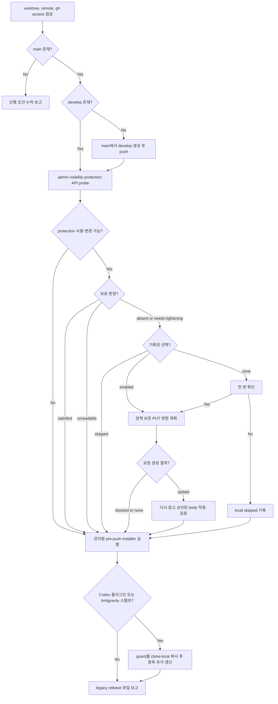

# GitHub Sync

<!-- jig:skill-source-digest f540337856ad091c0c24956d31be7dc804ec0b91 -->

[English](../../en/skills/github-sync.md) · [스킬 index](index.md) · [GitHub 저장소 설정](../github-repository-settings.md)

## 개요

`github-sync`는 저장소를 jig의 CLI release 모델에 수렴합니다. `main`·`develop`, 선택적 server-side protection, 그리고 두 겹의 local guard — git `pre-push` hook과, Codex·Antigravity에 네이티브로 설치하는 `PreToolUse` push hook(Claude Code는 같은 hook을 플러그인 안에서 실행) — 을 관리합니다. 멱등적이며 release, tag, PR template, label, Release Drafter automation은 다루지 않습니다.

## 사용 시점

`jig-setup` 중, `jig-update` 후, `develop`이 없을 때, protection이나 local guard가 drift됐을 때, 새 clone에 protection 선택이 기록되지 않았을 때 사용합니다. 발행은 `github-release`의 역할이며 sync는 release를 만들지 않습니다.

## 실행 방법과 전제 조건

- Claude Code: `/jig:github-sync`
- Codex: `jig:github-sync`
- Antigravity: `jig-github-sync`
- Git 저장소가 필요합니다. GitHub 작업에는 `gh`, 저장소 권한, `JIG_GITHUB_PROFILE` 또는 local `jig.githubProfile`이 필요합니다.

## 작업 흐름

jig가 관리하는 것은 force push·삭제 차단뿐이며, 기존 review·검사 앱 연결·접근 제한 등은 보존합니다. HTTP 상태와 body를 따로 보관한 뒤 스킬 디렉터리에서 `classify-protection.sh --file <response.json>`과 `plan-protection.sh < <response.json>`을 실행합니다. 둘 다 `jq`가 필요한 로컬 도구이며 GitHub를 호출하지 않습니다.

요청 생성기는 이미 충족된 정책에는 `none`, 확인된 부재 또는 지원되는 강화에는 PUT용 `body`를 포함한 `update`, 해석 불가·미지원 데이터에는 body 없는 `blocked`를 반환합니다. GET의 플래그 객체와 사용자·팀·앱 정보를 PUT 형식으로 변환합니다. 알 수 없는 필드·불완전한 정책·별도 API가 필요한 서명 설정·검사 앱 연결 미확정은 변경을 차단합니다. 일반 404나 인증·호출 한도 오류는 부재가 아니며, 접근 가능 여부와 `Branch not protected` 응답이 확인돼야 합니다.

요청 생성은 승인이 아닙니다. `enabled`는 두 보장에 재사용하고 `skipped`는 유지합니다. 보호된 한 브랜치를 보고 다른 브랜치 변경까지 승인됐다고 추론하지 않습니다. 두 브랜치가 모두 충족하고 기존 skipped가 없을 때만 충족 상태를 enabled로 기록합니다. 승인된 PUT 전 재조회하고 이후 보존 결과를 검증합니다. 원본이 달라지면 계획을 폐기합니다. 조회·쓰기는 트랜잭션이 아니므로 다른 관리자의 동시 변경은 한계로 남습니다.

## 읽기·변경 범위

Git branch·remote, GitHub permission·protection, `jig.githubProfile`, `jig.githubHost`, `jig.branchProtection`을 읽습니다. `develop`을 생성·push하고, 확인 후 protection을 적용하고, local 선택을 기록하고, 배포된 `assets/pre-push` 원본과 `scripts/manage-pre-push.sh` helper로 `.git/hooks/pre-push`를 관리할 수 있습니다.

local guard는 `main`·`develop` 삭제와 non-fast-forward push를 막고 `main`은 `develop:main`으로만 갱신하게 합니다. local 방어일 뿐이며 server-side protection이 최종 방어선입니다.

helper는 원자적으로 설치하고 jig 소유 설치본의 drift를 복구하며 `core.hooksPath`가 설정돼 있으면 설치를 거부합니다. marker가 없는 사용자 hook은 명시적 확인 없이 교체하지 않습니다. 교체가 승인되면 `.git/hooks/pre-push.jig-user-backup`으로 보존합니다.

두 번째 겹은 `scripts/manage-native-hooks.sh`입니다. Codex는 플러그인 자체의 hook을 실행하지 않으므로, 감지된 호스트마다 hook 항목 하나를 추가합니다 — Codex는 `.codex/hooks.json`, Antigravity는 `.agents/hooks.json`. 이 항목은 모든 shell 명령 앞에서 guard를 실행하므로, git hook이 거부할 push나 `--no-verify`가 붙은 push는 실행 전에 거부됩니다. Codex는 Codex 설정에 jig 플러그인이 설치돼 있거나 legacy `AGENTS.md` 스탬프가 있으면 감지되고, Antigravity는 `GEMINI.md` 스탬프로 감지됩니다.

manager는 배포된 `assets/guard-push.sh`를 `<git common dir>/jig/guard-push.sh`로 clone-local 복사하고 항목이 그곳을 가리키게 합니다. 덕분에 jig가 플러그인으로 왔든 스킬 파일로 왔든 같은 항목이 동작하고 플러그인 업그레이드에도 살아남습니다. 항목은 실행 시점에 그 경로를 해석하며 복사본이 없으면 통과시킵니다. 파일 안의 다른 항목은 보존합니다. 병합에는 `jq`가 필요하고, 없으면 새 파일만 씁니다. Codex는 사용자가 `/hooks`에서 한 번 검토한 뒤에만 hook을 실행하므로 보고서가 매번 이를 알립니다. project scope에만 설치합니다.

## 판단 지점과 안전 규칙

- checkout이 `enabled`나 `skipped`를 기록하지 않았고, 두 보장이 아직 성립하지 않으며, protection이 가능하면 한 번 묻습니다.
- 저장소가 이미 가진 protection을 제거하거나 약화시키지 않습니다. required review, required check, push restriction, admin enforcement는 저장소의 것이며 모든 sync를 그대로 통과합니다.
- marker가 없는 사용자 `pre-push` hook은 명시적 확인과 `.jig-user-backup` 없이 덮어쓰지 않습니다.
- `.codex/hooks.json`·`.agents/hooks.json`의 사용자 항목은 고치지 않습니다. jig marker가 있는 항목만 추가·갱신·제거하고, 파싱할 수 없는 파일이나 symlink는 거부합니다.
- Codex hook 신뢰를 사용자 대신 부여하지 않습니다. `/hooks` 단계를 보고할 뿐입니다.
- force push, branch 삭제, tag·release 생성, `core.hooksPath` 설정, default branch 이름 변경, legacy 파일 무단 삭제를 하지 않습니다.
- protection이 불가하거나 건너뛰면 local guard가 이 머신의 유일한 방어선임을 보고합니다.

## 제거 정리

현재 프로젝트에서 스킬이나 플러그인을 제거하기 전에 두 helper의 `uninstall` mode를 실행합니다 — guard payload가 아직 있을 때 네이티브 hook manager를 먼저. 네이티브 manager는 자기 항목만 제거하고, 다른 항목이 없던 파일(과 비게 된 `.codex/`)만 삭제하며, 어떤 jig 항목도 가리키지 않게 되면 clone-local guard 복사본도 제거합니다. pre-push manager는 jig 소유 marker가 있는 hook만 제거하며 승인 후 보존했던 사용자 hook이 있으면 복원합니다. user/global 설치 제거로는 모든 clone을 발견할 수 없으므로 각 프로젝트 checkout에서 명시적으로 정리해야 합니다.

## 결과물

branch 생성·현재 상태, branch별 protection 상태(이미 충족·보장 추가·skipped·unavailable·not permitted·unreadable)와 보존한 기존 protection, local pre-push guard, 감지된 호스트별 네이티브 hook 상태(Codex는 `/hooks` 신뢰 안내 포함), legacy 파일, 실행하지 못한 명령과 다음 조치를 보고합니다.

## 관련 스킬

- [`jig-setup`](jig-setup.md): sync 전 GitHub 프로필 선택
- [`jig-update`](jig-update.md): payload 갱신 후 저장소 수렴 위임
- [`jig-doctor`](jig-doctor.md): protection·guard drift read-only 진단
- [`github-release`](github-release.md): 수렴된 branch 모델 사용

## 원본

- [`skills/github-sync/SKILL.md`](../../../skills/github-sync/SKILL.md)
- [`guard-push.sh`](../../../skills/github-sync/assets/guard-push.sh): 모든 호스트가 공유하는 유일한 guard 원본
- [`classify-protection.sh`](../../../skills/github-sync/scripts/classify-protection.sh): 스킬이 읽는 protection 판정
- [GitHub 저장소 설정](../github-repository-settings.md)

- [`plan-protection.sh`](../../../skills/github-sync/scripts/plan-protection.sh)·[`protection-request.jq`](../../../skills/github-sync/scripts/protection-request.jq): 로컬 요청 생성·보수적 GET→PUT 변환
