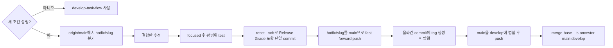

# Hotfix Flow

<!-- jig:skill-source-digest 7f8d3bb38dc92ed4559388b0b4ce42453e7e31fe -->

[English](../../en/skills/hotfix-flow.md) · [스킬 목록](index.md)

## 개요

`hotfix-flow`는 이미 릴리즈된 결함의 수정을, `develop`에 쌓인 작업보다 먼저 내보냅니다. `main`에서 분기해 squash한 커밋 하나를 guard가 허용하는 hotfix push로 `main`에 올리고, tag와 release를 발행한 뒤 `main`을 `develop`에 병합해 다음 일반 release가 그대로 fast-forward되게 합니다.

## 사용 시점

세 조건이 모두 성립할 때만 씁니다. 결함이 이미 `main`에서 도달 가능하고, 다음 `develop` release를 기다릴 수 없으며, `develop`에 아직 내보내면 안 되는 작업이 있을 때입니다. `develop`에 미릴리즈 작업이 없으면 hotfix가 아닙니다 — `develop-task-flow`로 고치고 평소대로 release합니다.

## 실행 방법과 입력

- Claude Code: `/jig:hotfix-flow`
- Codex·Antigravity: `jig-hotfix-flow`
- 입력: `origin/main`에서 도달 가능한 결함, `main`에서 도달 가능한 최신 tag, project rubric, 인증된 GitHub profile

## 작업 흐름

## 되돌림 병합이 절차의 일부인 이유

hotfix는 `develop`에 없는 commit을 `main`에 만드는 유일한 연산입니다. 그 어긋남이 남아 있는 동안 `git push origin develop:main`은 fast-forward되지 않고, `github-release`는 force push 대신 실행을 거부합니다. 되돌림 병합이 이 불변식을 복구하므로, 후속 작업이 아니라 같은 세션 안에서 끝냅니다.

되돌릴 때는 `git merge main`을 쓰고 cherry-pick은 쓰지 않습니다. cherry-pick은 변경을 새 SHA로 복사해 `main`을 `develop` 이력 밖에 남기고, 이후 모든 release를 깨뜨립니다. 병합 commit 자체는 release note에 오르지 않습니다 — `github-release`가 `git log --no-merges`로 읽기 때문입니다.

## 등급 판정과 버전

수정은 `JIG_VERSION_RUBRIC`, local `jig.versionRubric`, `.jig/versioning.md` 순으로 해석한 project rubric으로 판정합니다. 이 수정 하나에만 적용하며 `git diff --name-only origin/main...HEAD`를 근거로 쓰고, `## Interface Paths` 표가 있으면 거기서 바닥을 읽습니다. 결과는 `Release-Grade` trailer로 기록합니다. 버전은 `origin/main`에서 도달 가능한 최신 tag에서 계산하고, tag는 `main`에 올라간 commit에 만듭니다.

hotfix는 보통 `patch`지만 자동으로 그렇게 되지는 않습니다. 동작이 조용히 바뀌는 수정은 더 높게 판정됩니다.

## 읽기·변경 범위

Git ref, status, log, tag, rubric, 수정 대상 코드를 읽습니다. branch 하나, squash commit 하나, `main`으로의 fast-forward push 하나, tag 하나, GitHub Release 하나, `develop`으로의 병합 하나를 만듭니다. rubric은 수정하지 않고 force push도 하지 않습니다.

## 중단 조건과 안전 규칙

- `git rev-list --count origin/main..origin/develop`가 `0`이면 중단합니다. 지킬 미릴리즈 작업이 없으므로 일반 작업입니다.
- 세 조건이 성립하지 않거나 `main` push가 거부되면 중단합니다. guard는 fast-forward에 더해 `main`보다 정확히 한 commit 앞설 것을 요구하며, 이것이 `develop`에서 딴 branch가 미릴리즈 작업을 릴리즈에 끌고 들어가는 것을 기계적으로 막습니다.
- hook bypass, force push, `develop`에서의 hotfix 분기, 결함 외 변경 동반을 하지 않습니다.
- `main`이 `develop`보다 앞선 상태로 두지 않습니다. `git merge-base --is-ancestor origin/main origin/develop`이 성공해야 작업이 끝난 것입니다.
- 실패한 `develop:main` fast-forward를 force push로 해결하지 않습니다.

## 결과물

branch와 시작 `origin/main` commit, 변경 파일, 실행한 test, 판정 등급과 근거 rubric 문항 및 기록한 `Release-Grade`, tag와 release URL, 되돌림 병합과 그 검증, 의도적으로 제외한 미릴리즈 `develop` 작업, blocked command를 보고합니다.

## 관련 스킬

- [`develop-task-flow`](develop-task-flow.md): 다음 release를 기다릴 수 있는 모든 수정
- [`github-release`](github-release.md): 불변식 복구 후 `develop` 승격
- [`github-sync`](github-sync.md): `hotfix/<slug>:main` 착지를 허용하는 `pre-push` guard 설치
- [`version-rubric`](version-rubric.md): 판정 기준 파일 소유

## 원본

- [`skills/hotfix-flow/SKILL.md`](../../../skills/hotfix-flow/SKILL.md)
