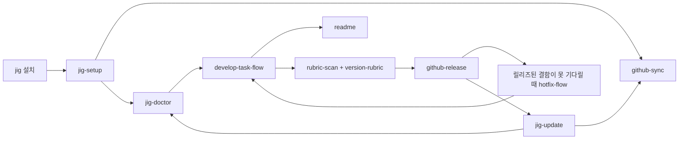

# jig 스킬 가이드

[English](../../en/skills/index.md) · [문서 홈](../index.md)

jig는 단순한 prompt 모음이 아니라 저장소 절차를 배포합니다. 아래 가이드는 각 `SKILL.md`의 사용자 계약, 즉 사용 시점, 변경 범위, 중단 조건, 다른 스킬로의 위임을 설명합니다.

각 언어 guide는 전체 source skill payload(`SKILL.md`, script, asset, reference, catalog)의 digest를 기록합니다. 어느 한 언어라도 이전 payload를 가리키면 distribution validation이 실패하므로 skill 변경 때마다 두 guide를 모두 검토해야 합니다. 검토 후 `scripts/update-skill-doc-digests.sh <name>`으로 두 digest를 갱신합니다.

## 전체 생명주기

초기 설정에서 저장소에 올바른 GitHub identity를 연결하고, 일반 작업은 `develop`에 합친 뒤 릴리즈 시 `main`으로 fast-forward합니다. 이후 update와 doctor가 감지된 모든 설치본을 관리합니다.

## 상황별 스킬

| 필요 | 스킬 | Claude Code | Codex / Antigravity |
|---|---|---|---|
| 초기 설정 마무리 | [`jig-setup`](jig-setup.md) | `/jig:jig-setup` | `jig-setup` |
| GitHub 수렴 | [`github-sync`](github-sync.md) | `/jig:github-sync` | `jig-github-sync` |
| jig 진단 | [`jig-doctor`](jig-doctor.md) | `/jig:jig-doctor` | `jig-doctor` |
| 저장소 정리 | [`repo-hygiene`](repo-hygiene.md) | `/jig:repo-hygiene` | `jig-repo-hygiene` |
| 이력 감사 | [`conformance-audit`](conformance-audit.md) | `/jig:conformance-audit` | `jig-conformance-audit` |
| jig 업데이트 | [`jig-update`](jig-update.md) | `/jig:jig-update` | `jig-update` |
| 일반 개발 | [`develop-task-flow`](develop-task-flow.md) | `/jig:develop-task-flow` | `jig-develop-task-flow` |
| 긴급 수정 | [`hotfix-flow`](hotfix-flow.md) | `/jig:hotfix-flow` | `jig-hotfix-flow` |
| 릴리즈 발행 | [`github-release`](github-release.md) | `/jig:github-release` | `jig-github-release` |
| README 관리 | [`readme`](readme.md) | `/jig:readme` | `jig-readme` |
| rubric 추천 | [`rubric-scan`](rubric-scan.md) | `/jig:rubric-scan` | `jig-rubric-scan` |
| rubric 작성 | [`version-rubric`](version-rubric.md) | `/jig:version-rubric` | `jig-version-rubric` |

Claude Code는 `jig` plugin namespace로 스킬을 부릅니다. Codex와 Antigravity는 `jig-` prefix 디렉터리를 사용하며, 이미 `jig-`로 시작하는 이름에는 prefix를 중복하지 않습니다.
