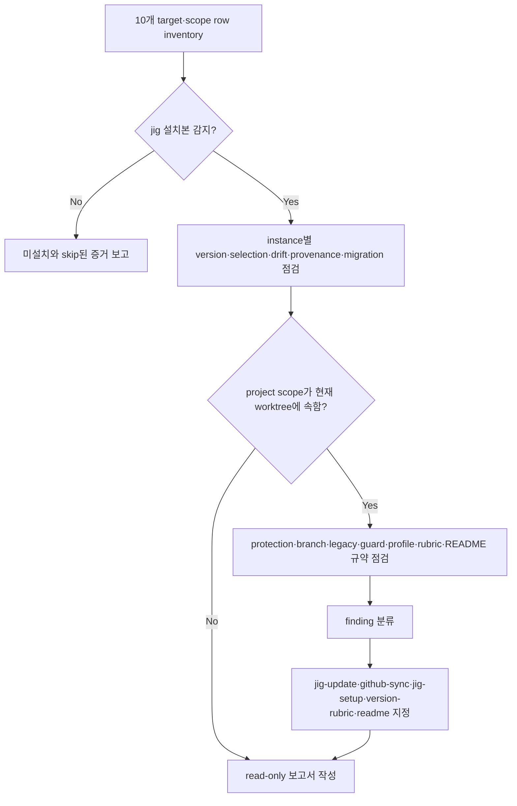

# jig Doctor

<!-- jig:skill-source-digest e83c9c4e5df46b3f7be0893d690cad1047cc0137 -->

[English](../../en/skills/jig-doctor.md) · [스킬 index](index.md)

## 개요

`jig-doctor`는 project·user scope에서 감지한 Claude Code, Codex, Antigravity 설치본 전체를 점검하는 read-only health check입니다. 먼저 모든 설치본을 inventory하고 각 instance를 독립적으로 판정한 뒤, 현재 Git worktree에 속한 project scope 설치가 있을 때만 저장소 상태를 진단합니다.

## 사용 시점

setup·update 후, version·skill 선택이 다르게 보일 때, release 전, protection·local guard·profile·rubric·README 규약·migration·legacy 상태가 불분명할 때 사용합니다. 진단 결과를 직접 고치지 않고 각 finding의 수리 소유 스킬을 알려 줍니다.

## 실행 방법

- Claude Code: `/jig:jig-doctor`
- Codex·Antigravity: `jig-doctor`

## Inventory 모델

Claude Code plugin project·local·user·managed, Claude standalone project·user, Codex project·global, Antigravity project·global의 10개 row를 독립적으로 점검합니다. rules 파일은 jig managed block이 있을 때만 설치 증거입니다. standalone root는 ledger·provenance 또는 보수적 legacy identity가 소유권을 증명해야 합니다.

standalone 상태는 `verified`, `legacy-unledgered`, `ledger-invalid`, `partial`, `provenance-conflict`, `non-owned`, `source-mirror`, `absent`로 구분합니다. 사용자가 작성한 `non-owned` root는 jig defect가 아닙니다.

## 작업 흐름

plugin payload는 host가 관리하므로 file payload tag와 비교하지 않습니다. version이 있는 file installation은 해당 release의 `dist/files.tsv`와 비교하고 missing, drift, leftover를 따로 보고합니다.

## 읽기 범위와 외부 점검

plugin settings, standalone ledger·provenance, managed block·version stamp, release metadata, payload catalog, Git branch 관계, protection·ruleset, `.git/hooks/pre-push`, local Git config, `.jig/versioning.md`, legacy release 파일, label, `.bak` leftover를 읽습니다. `gh`, `git`, 배포된 standalone inspector를 호출할 수 있지만 모두 read-only입니다.

## 안전·실패 처리

- 파일, 설정, branch, label, plugin, 설치본을 변경하지 않습니다.
- 프로젝트 소유 `.jig/`나 일반 사용자 스킬을 payload drift로 판정하지 않습니다.
- tool이 없으면 독립적인 점검은 계속하고 해당 tool에 의존하는 점검만 skipped로 보고합니다.
- user/global-only 설치에서는 관계없는 현재 디렉터리의 repository check를 실행하지 않습니다.
- protection `403`이나 기록된 skip은 정보이며 자동으로 defect가 되지 않습니다.

## 결과와 수리 소유권

inventory, instance별 version·selection·drift·provenance, pending migration, 선택적 protection, branch divergence, legacy leftover, local guard, profile, rubric, README 규약, recommended action을 보고합니다. payload·version·provenance는 `jig-update`, protection·guard는 `github-sync`, profile은 `jig-setup`, rubric은 `version-rubric`, README 규약은 `readme`가 수리합니다.

`.jig/` 아래 project-owned 파일 둘은 같은 방식으로 읽습니다. 경로를 해석하고, 출처를 보고하고, 어떤 section이 있는지 밝히고, 커밋되어 있는지 확인합니다 — 커밋되지 않은 파일은 한 기계에서만 적용되고 다른 곳에는 닿지 않습니다. 둘 다 payload와 대조하지 않고, 파일이 없는 것은 결함이 아니라 정상 상태입니다. rubric이 없으면 `github-release`가 멈추므로 여전히 중요하지만, README 규약이 없으면 `readme` 스킬이 일반 기본값으로 돌아갈 뿐입니다. branch divergence는 사람이 조정해야 하며 force push하지 않습니다.

## 관련 스킬

- [`jig-update`](jig-update.md): 지원되는 설치 finding 복구
- [`github-sync`](github-sync.md): protection·local guard 복구
- [`jig-setup`](jig-setup.md): profile·불완전 setup 복구
- [`version-rubric`](version-rubric.md): rubric 생성·복구
- [`readme`](readme.md): 이 스킬이 보고하는 README 규약의 소유자

## 원본

- [`skills/jig-doctor/SKILL.md`](../../../skills/jig-doctor/SKILL.md)
- [`inspect-claude-standalone.sh`](../../../skills/jig-doctor/scripts/inspect-claude-standalone.sh)
