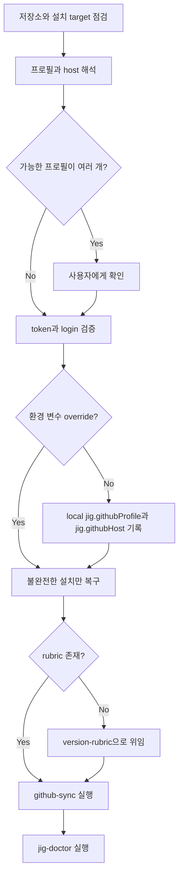

# jig Setup

[English](../../en/skills/jig-setup.md) · [스킬 index](index.md) · [문서 홈](../index.md)

## 개요

`jig-setup`은 저장소 설치를 마무리합니다. 전역 active `gh` 계정을 바꾸지 않고 현재 checkout에 인증된 GitHub CLI 프로필을 연결하고, 불완전한 target을 복구하며, 버전 rubric과 저장소 설정을 수렴한 뒤 read-only 진단으로 끝냅니다.

## 사용 시점

jig 설치 직후, `jig.githubProfile`이 없을 때, 여러 GitHub 계정 중 올바른 identity가 불명할 때, 설치된 target이 불완전할 때 사용합니다. 릴리즈를 발행하거나 branch를 강제로 바꾸거나 rubric 본문을 직접 소유하지 않습니다.

## 실행 방법

- Claude Code: `/jig:jig-setup`
- Codex·Antigravity: `jig-setup`
- 자연어: "`your-account` 프로필로 이 저장소의 jig 설정을 마무리해 줘."

## 입력과 전제 조건

- jig가 최소 하나의 target에 설치된 Git worktree
- 저장소 수렴이 필요하면 GitHub CLI
- 프로필 우선순위: 명시적 입력, `JIG_GITHUB_PROFILE`, local `jig.githubProfile`, 저장소 owner와 같은 인증 login
- host 우선순위: `JIG_GITHUB_HOST`, local `jig.githubHost`, `github.com`

환경 변수는 session override입니다. 그 외에는 선택한 login과 host만 local Git config에 기록하고 credential은 GitHub CLI credential store에 남겁니다.

## 작업 흐름

Claude Code 복구는 감지된 scope에서 `jig@jig`가 enable되었는지 확인합니다. Codex와 Antigravity는 managed stamp나 `jig-setup` payload가 불완전할 때만 기존 skill 선택을 보존하며 installer를 다시 실행합니다.

## 읽기·변경 범위

plugin/settings inventory, `AGENTS.md`, `GEMINI.md`, Git config, GitHub identity, `.jig/versioning.md`를 읽습니다. local `jig.githubProfile`과 `jig.githubHost`를 쓸 수 있고, 지원되는 installer로 jig payload를 복구하며, 저장소 설정은 `github-sync`로 위임합니다. OAuth token은 저장소나 Git config에 저장하지 않습니다.

## 판단 지점과 안전 규칙

- 가능한 프로필이 여러 개면 사용자에게 묻습니다.
- 요청한 프로필이 미인증 상태면 interactive `gh auth login`이 필요할 수 있습니다.
- `gh auth switch`, shell startup 파일 변경, token 노출, rubric 직접 편집, force push, branch 삭제, release 생성을 하지 않습니다.
- 수정된 사용자 파일을 보존하고 복구 시 installer backup 규칙을 따릅니다.

## 결과물

최종 보고에 target·scope, 프로필 source·login·host, 변경된 local config, rubric source·kind, 복구 상태, `github-sync`·`jig-doctor` 결과를 남깁니다.

## 관련 스킬

- [`version-rubric`](version-rubric.md): `.jig/versioning.md` 소유
- [`rubric-scan`](rubric-scan.md): 필요한 프로젝트 기준 추천
- [`github-sync`](github-sync.md): branch·protection 수렴
- [`jig-doctor`](jig-doctor.md): 변경 없는 최종 확인

## 원본

- [`skills/jig-setup/SKILL.md`](../../../skills/jig-setup/SKILL.md)
