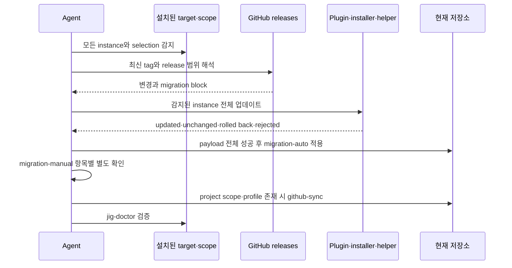

# jig Update

<!-- jig:skill-source-digest 5107b2656d36f84ad70f69c00b391cc553d31db2 -->

[English](../../en/skills/jig-update.md) · [스킬 index](index.md)

## 개요

`jig-update`는 어떤 agent에서 실행했는지와 관계없이 현재 project와 local user 환경에서 감지한 모든 jig 설치본을 갱신합니다. target과 scope는 각각 독립 설치본으로 유지하고 선택된 skill set을 보존하며, 미설치 target을 추가하거나 scope를 넓히지 않습니다.

## 사용 시점

설치된 Claude Code plugin, 기존 Claude standalone, Codex, Antigravity를 최신 GitHub release로 옮길 때 사용합니다. 중간 release migration을 수집하고, 적용 가능한 project 저장소를 수렴한 뒤 `jig-doctor`로 끝냅니다.

## 실행 방법

- Claude Code: `/jig:jig-update`
- Codex·Antigravity: `jig-update`

## 설치·소유권 모델

Claude plugin scope는 host가 관리합니다. 기존 standalone root는 `.jig-installation`과 skill별 `.jig-provenance`를 사용하며, ledger가 없는 legacy root는 보수적 identity 검증을 통과해야 합니다. Codex와 Antigravity는 감지된 target·scope별로 해당 instance의 stamped selection을 넘겨 `install.sh`를 다시 실행합니다.

`dist/files.tsv`는 신뢰하지 않는 입력으로 취급합니다. standalone path는 물리적이고 symlink가 아닌 skill root 안에 남아야 합니다. 이름 일치만으로는 소유권을 증명할 수 없습니다.

## 작업 흐름

하나의 current instance가 다른 outdated·unknown instance를 가리지 않습니다. standalone update는 선택 payload 전체를 먼저 download·validate한 뒤 root 단위 transaction을 시작하고, apply가 실패하면 destination, 기존 backup, provenance, ledger를 복원합니다.

## Migration 처리

release note에서 줄 전체가 marker인 `migration-auto`와 `migration-manual` block만 실행 입력입니다. auto 항목은 payload update 전체가 성공한 후 실행합니다. manual 항목은 end-to-end update 요청이 있어도 항목별 승인이 필요합니다. marker 밖의 text는 설명이며 command가 아닙니다.

## 읽기·변경 범위

모든 설치 증거, stamp, selection, ledger, provenance, release note, payload catalog을 읽습니다. plugin scope는 host, standalone root는 transactional helper, Codex·Antigravity는 pin된 installer로 갱신합니다. 변경된 file installation에는 `.bak`을 남깁니다. project 소유 `.jig/versioning.md`는 건드리지 않습니다.

## 안전·실패 처리

- installer `--force`, force push, file·branch·label 삭제, plugin uninstall, target·scope 추가, release 생성을 하지 않습니다.
- unsafe payload path나 소유권 충돌은 해당 standalone root를 변경하기 전에 거부합니다.
- 하나의 root가 rejected·rolled back되어도 독립 root는 계속하지만, 모든 root가 성공하기 전에 migration을 실행하지 않습니다.
- installer·stamp·auto migration 실패 시 임의로 해결하지 않고 중단합니다.
- global-only update는 현재 저장소를 변경·수렴하지 않습니다.

## 결과물

instance별 이전·이후 version·selection, plugin reload 필요 여부, standalone transaction·backup, 건너뛴 release, auto migration, approved·pending manual 항목, repository convergence, doctor 결과, 다음 조치를 보고합니다.

## 관련 스킬

- [`jig-doctor`](jig-doctor.md): 공통 inventory 계약으로 결과 검증
- [`github-sync`](github-sync.md): project 저장소 설정 수렴
- [`jig-setup`](jig-setup.md): 누락된 repository profile 설정
- [`version-rubric`](version-rubric.md): `.jig/versioning.md` 독점 소유

## 원본

- [`skills/jig-update/SKILL.md`](../../../skills/jig-update/SKILL.md)
- [`update-claude-standalone.sh`](../../../skills/jig-update/scripts/update-claude-standalone.sh)
