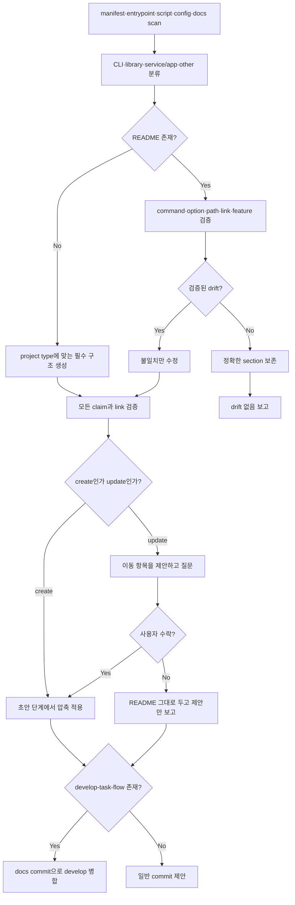

# README 스킬

<!-- jig:skill-source-digest 2e2c12306ce0a0fbb2299af91be5de4a543886f4 -->

[English](../../en/skills/readme.md) · [스킬 index](index.md)

## 개요

`readme`는 README가 없으면 생성하고, 있으면 저장소 증거와 대조해 검증된 drift만 수정합니다. 먼저 project type을 분류해 구조를 선택하고, 두 곳 이상에 적힌 사실을 상세 문서로 옮겨 결과물을 짧게 유지하며, 저장소가 이미 쓰는 언어를 보존합니다.

## 사용 시점

문서를 처음 작성할 때, command·option·path가 바뀐 후, README claim이 구현과 다를 수 있을 때, 또는 README가 불어나 같은 사실이 여러 section에 흩어졌을 때 사용합니다. 일반 marketing writer가 아니며 검증할 수 없는 claim은 쓰지 않고 보고합니다.

## 실행 방법

- Claude Code: `/jig:readme`
- Codex·Antigravity: `jig-readme`

## 작업 흐름

CLI project는 command·option, library는 API summary·example, service/app은 dev·prod 실행과 필수 environment variable를 추가합니다.

## 압축

길이는 목표가 아니라 증상으로 다룹니다. 긴 README는 대개 할 말이 많은 프로젝트가 아니라 같은 사실을 여러 곳에 쓴 문서입니다. 그래서 규칙은 **지우지 말고 옮기기**입니다. 사실은 독자가 먼저 도달하는 한 곳에 남기고 나머지는 그 주제를 이미 다루는 상세 문서로 보냅니다. 맞춰야 할 줄 수는 없습니다. 정말로 필요한 API 예제를 담은 library README는 길어도 길지 않고, 같은 말을 두 번 하는 짧은 README는 여전히 틀렸습니다.

나머지는 문서 앞자리를 차지할 자격에 관한 규칙입니다.

- 소개는 어떤 기능이 있는지가 아니라 무엇이 편해지는지를 말하고, 근거가 강한 순으로 정렬하며, 주변 문단도 같은 순서를 따릅니다
- 저장소가 보일 수 없는 주장은 완화하지 않고 뺍니다. 값이 나는 조건을 함께 적어 해당하지 않는 독자가 빨리 거를 수 있게 합니다
- 로드맵과 설계 기록은 문서 홈으로 옮깁니다. 설치 전에 읽는 내용이 아닙니다
- build·검증 명령은 `
` block이나 기여 문서로 접습니다
- 인자 하나만 다른 명령 block은 하나로 합칩니다
- section이 넷을 넘으면 제목 아래에 한 줄 이동 링크를 둡니다

이미 공개된 README에서는 이 중 무엇도 조용히 일어나지 않습니다. 반복된 사실과 옮겨 갈 위치를 먼저 제시하고 묻습니다. 거절된 제안도 보고에 남습니다.

## 읽기·변경 범위

manifest, lock file, entrypoint, CLI definition, script, service config, docs, example을 읽습니다. 이 파일로 근거를 확인한 README 내용만 쓸 수 있습니다. 기존 README는 drift list를 먼저 만들고 정확한 section을 그대로 둡니다.

## 정확성·layout·안전 규칙

- command는 code나 build·install file에 존재해야 하고 local link target은 모두 실제로 있어야 합니다.
- badge, integration, option, feature를 지어내지 않습니다.
- identifier table의 설명은 이름이 wrap되지 않게 짧게 유지하고 설명이 길면 list를 사용합니다.
- 공개된 README를 묻지 않고 재구조화하지 않습니다. update 경로의 압축은 제안이고 사용자가 수락한 뒤에만 적용합니다.
- 기존 언어를 보존하고 새 README는 repository 언어, 기본은 English를 사용합니다.
- `develop-task-flow`가 있으면 `develop`의 `docs:` squash commit으로 병합합니다.

## 결과물

project type, create·update path, 발견한 drift와 fix, 반복된 사실과 옮겨 갈 위치를 담은 압축 제안과 사용자 수락 여부, 검증할 수 없어 제외한 claim을 보고합니다.

## 관련 스킬

- [`develop-task-flow`](develop-task-flow.md): README 변경의 branch·merge workflow 소유
- [`jig-doctor`](jig-doctor.md): README usage가 정확히 설명해야 할 설치 사실 진단

## 원본

- [`skills/readme/SKILL.md`](../../../skills/readme/SKILL.md)
