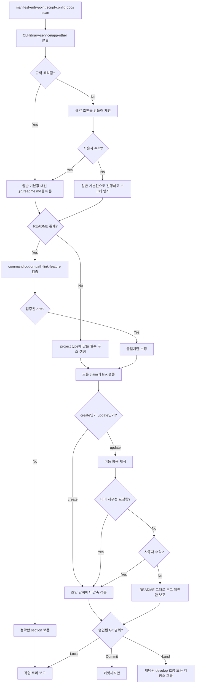

# README 스킬

<!-- jig:skill-source-digest ff8e7b1cf64d75370b091a29dd2d9dbab7ca1daa -->

[English](../../en/skills/readme.md) · [스킬 index](index.md)

## 개요

`readme`는 README가 없으면 생성하고, 있으면 저장소 증거와 대조해 검증된 drift만 수정합니다. 먼저 project type을 분류하고, `.jig/readme.md`에 저장소 고유의 README 규약이 있으면 그것을 읽으며, 두 곳 이상에 적힌 사실을 상세 문서로 옮겨 결과물을 짧게 유지하고, 저장소가 이미 쓰는 언어를 보존합니다.

## 사용 시점

문서를 처음 작성할 때, command·option·path가 바뀐 후, README claim이 구현과 다를 수 있을 때, 또는 README가 불어나 같은 사실이 여러 section에 흩어졌을 때 사용합니다. 일반 marketing writer가 아니며 검증할 수 없는 claim은 쓰지 않고 보고합니다.

## 실행 방법

- Claude Code: `/jig:readme`
- Codex: `jig:readme`
- Antigravity: `jig-readme`

## 작업 흐름

CLI project는 command·option, library는 API summary·example, service/app은 dev·prod 실행과 필수 environment variable를 추가합니다.

## README 규약

project type이 같아도 저장소마다 README를 다르게 씁니다. 어떤 곳은 번역 미러를 두고, 어떤 곳은 설치를 가이드 문서로 빼고, 어떤 곳은 기여자들이 이미 따르는 표 관습이 있습니다. 이건 스캔으로 알아낼 수 있는 사실이 아니라 결정이므로, 한 번 기록해 두고 이후 실행마다 읽습니다.

해석 순서는 `JIG_README_PROFILE` → `git config --local --get jig.readmeProfile` → `.jig/readme.md`입니다. 해석된 규약은 **일반 section layout과 언어 규칙을 대체**하고, 규약이 말하지 않은 것만 기본값으로 돌아갑니다.

파일은 네 section이고 결정만 담습니다. 기준치도 검사 목록도 두지 않습니다 — README 품질은 스킬이 저장소를 앞에 두고 내리는 판정이기 때문입니다.

| Section | 정하는 것 |
|---|---|
| `## Languages` | 정본 파일, 미러 파일, 둘을 맞추는 방식 |
| `## Sections` | 이 저장소가 쓰는 section 순서 |
| `## Detail Docs` | README에서 빠지는 것과 받는 문서 |
| `## Conventions` | 표 스타일, 주장 규율, 에셋 경로 |

규약이 없으면 스캔 결과로 초안을 만들어 제안하고, 사용자가 수락한 뒤에만 `.jig/readme.md`를 씁니다. 거절도 정상 결과입니다 — 일반 기본값으로 진행하고 보고에 그렇게 적습니다. 기존 규약은 확인 없이 덮어쓰지 않고, `.jig/` 아래 다른 것은 건드리지 않습니다. `.jig/versioning.md`는 `version-rubric`의 소유입니다.

## 압축

길이는 목표가 아니라 증상으로 다룹니다. 긴 README는 대개 할 말이 많은 프로젝트가 아니라 같은 사실을 여러 곳에 쓴 문서입니다. 그래서 규칙은 **지우지 말고 옮기기**입니다. 사실은 독자가 먼저 도달하는 한 곳에 남기고 나머지는 그 주제를 이미 다루는 상세 문서로 보냅니다. 맞춰야 할 줄 수는 없습니다. 정말로 필요한 API 예제를 담은 library README는 길어도 길지 않고, 같은 말을 두 번 하는 짧은 README는 여전히 틀렸습니다.

나머지는 문서 앞자리를 차지할 자격에 관한 규칙입니다.

- 소개는 어떤 기능이 있는지가 아니라 무엇이 편해지는지를 말하고, 근거가 강한 순으로 정렬하며, 주변 문단도 같은 순서를 따릅니다
- 저장소가 보일 수 없는 주장은 완화하지 않고 뺍니다. 값이 나는 조건을 함께 적어 해당하지 않는 독자가 빨리 거를 수 있게 합니다
- 로드맵과 설계 기록은 문서 홈으로 옮깁니다. 설치 전에 읽는 내용이 아닙니다
- build·검증 명령은 `
` block이나 기여 문서로 접습니다
- 인자 하나만 다른 명령 block은 하나로 합칩니다
- section이 넷을 넘으면 제목 아래에 한 줄 이동 링크를 둡니다

이미 공개된 README에서는 이 중 무엇도 조용히 일어나지 않습니다. 반복된 사실과 이동 위치를 제시합니다. 이미 요청된 압축·재구성은 재확인 없이 적용하고, 그 밖의 구조 변경만 질문합니다. 거절된 제안도 보고합니다.

## 읽기·변경 범위

manifest, lock file, entrypoint, CLI definition, script, service config, docs, example을 읽습니다. 이 파일로 근거를 확인한 README 내용만 쓸 수 있습니다. 기존 README는 drift list를 만들고 정확한 내용을 보존하면서 요청된 편집·재구성을 적용합니다.

## 정확성·layout·안전 규칙

- command는 code나 build·install file에 존재해야 하고 local link target은 모두 실제로 있어야 합니다.
- badge, integration, option, feature를 지어내지 않습니다.
- identifier table의 설명은 이름이 wrap되지 않게 짧게 유지하고 설명이 길면 list를 사용합니다.
- 공개된 README를 묻지 않고 재구조화하지 않습니다. 다만 사용자가 이미 그 압축·재구조화를 요청했다면 질문으로 되돌리지 않고 적용한 뒤 보고합니다. 이미 받은 지시를 다시 확인하지 않습니다.
- 기존 diff와 사용자 변경을 보존합니다. 수정된 README라도 정상 편집에는 재승인을 요구하지 않고 승인 범위 밖 내용을 잃게 할 때만 묻습니다.
- `develop-task-flow`를 채택한 저장소에서만 현재 제한과 명시적으로 승인된 기존 정책을 전달해 위임합니다. 로컬 작업은 미커밋으로, 커밋만 승인된 작업은 병합 전에 멈춥니다.
- `.jig/readme.md`는 수락한 뒤에만 쓰고, 일반 README 갱신의 부수 효과로 쓰지 않으며, 기존 규약은 확인 없이 덮지 않습니다.
- 기존 언어를 보존하고 새 README는 repository 언어, 기본은 English를 사용합니다.
- 반영이 이미 승인되었으면 재확인 없이 `develop`의 `docs:` squash commit으로 진행합니다. 스킬 존재만으로 권한을 추론하지 않습니다.

## 결과물

project type, README 규약과 해석 출처(또는 제안했으나 거절됨), create·update path, 발견한 drift와 fix, 반복된 사실과 옮겨 갈 위치를 담은 압축 제안과 사용자 수락 여부, 검증할 수 없어 제외한 claim을 보고합니다.

## 관련 스킬

- [`develop-task-flow`](develop-task-flow.md): README 변경의 branch·merge workflow 소유
- [`jig-doctor`](jig-doctor.md): README usage가 정확히 설명해야 할 설치 사실 진단
- [`version-rubric`](version-rubric.md): `.jig/` 아래 다른 project-owned 파일의 소유자. 둘은 서로의 파일을 쓰지 않습니다

## 원본

- [`skills/readme/SKILL.md`](../../../skills/readme/SKILL.md)
