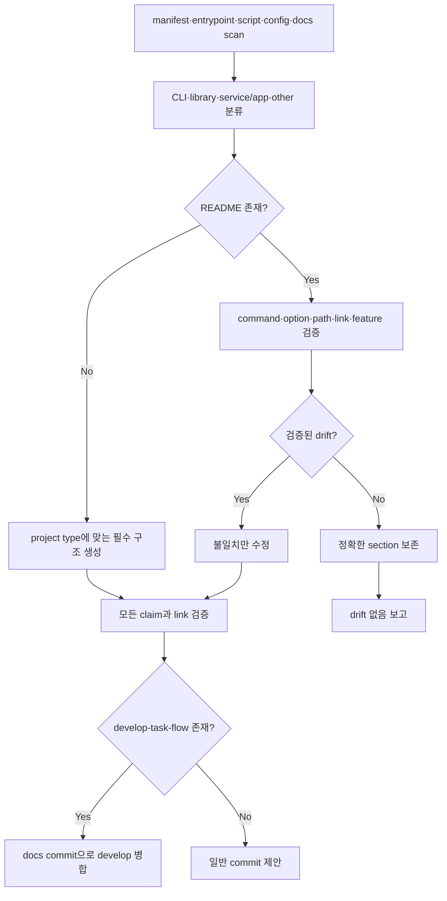

# README 스킬

<!-- jig:skill-source-digest 2bc05fbc4de7ef2ba3f585f2c8dc77a985eee1ff -->

[English](../../en/skills/readme.md) · [스킬 index](index.md)

## 개요

`readme`는 README가 없으면 생성하고, 있으면 저장소 증거와 대조해 검증된 drift만 수정합니다. 먼저 project type을 분류해 구조를 선택하고 저장소가 이미 쓰는 언어를 보존합니다.

## 사용 시점

문서를 처음 작성할 때, command·option·path가 바뀐 후, README claim이 구현과 다를 수 있을 때 사용합니다. 일반 marketing writer가 아니며 검증할 수 없는 claim은 쓰지 않고 보고합니다.

## 실행 방법

- Claude Code: `/jig:readme`
- Codex·Antigravity: `jig-readme`

## 작업 흐름

CLI project는 command·option, library는 API summary·example, service/app은 dev·prod 실행과 필수 environment variable를 추가합니다.

## 읽기·변경 범위

manifest, lock file, entrypoint, CLI definition, script, service config, docs, example을 읽습니다. 이 파일로 근거를 확인한 README 내용만 쓸 수 있습니다. 기존 README는 drift list를 먼저 만들고 정확한 section을 그대로 둡니다.

## 정확성·layout·안전 규칙

- command는 code나 build·install file에 존재해야 하고 local link target은 모두 실제로 있어야 합니다.
- badge, integration, option, feature를 지어내지 않습니다.
- identifier table의 설명은 이름이 wrap되지 않게 짧게 유지하고 설명이 길면 list를 사용합니다.
- 기존 언어를 보존하고 새 README는 repository 언어, 기본은 English를 사용합니다.
- `develop-task-flow`가 있으면 `develop`의 `docs:` squash commit으로 병합합니다.

## 결과물

project type, create·update path, 발견한 drift와 fix, 검증할 수 없어 제외한 claim을 보고합니다.

## 관련 스킬

- [`develop-task-flow`](develop-task-flow.md): README 변경의 branch·merge workflow 소유
- [`jig-doctor`](jig-doctor.md): README usage가 정확히 설명해야 할 설치 사실 진단

## 원본

- [`skills/readme/SKILL.md`](../../../skills/readme/SKILL.md)
