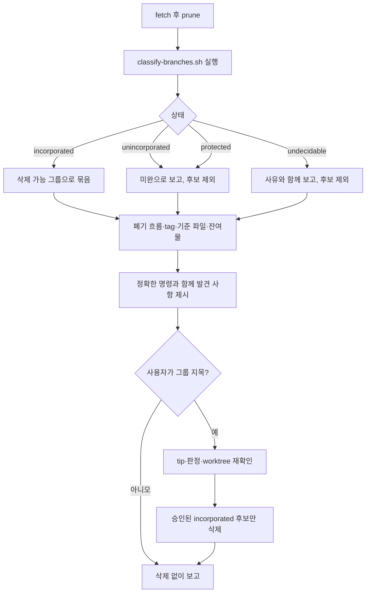

# Repo Hygiene

<!-- jig:skill-source-digest 3d10dfe3494b3728e563a577fae9e424368ff46b -->

[English](../../en/skills/repo-hygiene.md) · [스킬 목록](index.md)

## 개요

`repo-hygiene`은 jig로 오래 작업한 저장소에 쌓이는 잔여물을 점검하고 정리합니다. 작업이 이미 반영된 task branch, 폐기된 흐름이 남긴 branch, 낡은 remote-tracking ref, tag와 release 불일치, 도달하지 못하는 기준 파일, installer 잔여 파일이 대상입니다. 발견한 것은 모두 보고하고 삭제는 사용자가 지목한 것만 합니다.

## 사용 시점

jig로 한동안 작업해 branch 목록·tag·잔여 파일이 지저분해졌을 때 씁니다. 저장소가 아니라 jig 설치 상태를 보려면 `jig-doctor`를 씁니다.

## 실행 방법과 입력

- Claude Code: `/jig:repo-hygiene`
- Codex: `jig:repo-hygiene`
- Antigravity: `jig-repo-hygiene`
- 입력: 로컬 clone, `origin`, 해석된 기준 파일 경로, tag·release 대조용 인증된 GitHub profile

## 병합된 branch가 미병합으로 보이는 이유

`develop-task-flow`는 `git merge --squash`로 끝나므로 task branch의 tip이 `develop`의 조상이 되지 않습니다. 그래서 `git branch --merged develop`은 거의 아무것도 못 찾고 `--no-merged`는 몇 달 전에 반영된 작업까지 나열합니다.

단순 diff로도 판정되지 않습니다. `git diff develop...<branch>`는 공통 조상과 branch를 비교하므로 squash 병합 후에도 branch 자신의 변경을 그대로 보여 주고, `git diff develop..<branch>`는 두 tip을 비교하므로 이후 `develop`에 무관한 커밋이 하나만 들어와도 완료된 branch가 미완으로 보입니다.

스킬 디렉터리를 기준으로 `sh scripts/classify-branches.sh [--base develop] [--history-limit 200] [<local-branch>...]`를 실행합니다. TSV 출력은 상태·브랜치·사유입니다. 명시적으로 승인받을 삭제 후보에는 `incorporated`만 올립니다.

- `incorporated`: 작업이 바꾼 모든 경로의 현재 내용·유형·모드가 base와 같거나 작업 diff가 비어 있습니다. base의 무관한 경로는 제외합니다. 특정 병합 이력이 아닌 내용의 동등성을 뜻합니다.
- `unincorporated`: 다른 경로가 분기 전 버전 또는 작업의 이전 버전에 머물고, 분기 후 제한된 이력에서 최신 작업 버전을 가진 적이 없습니다. 불확실한 경로 수도 보고합니다.
- `undecidable`: 과거에는 같았지만 현재 내용이 달라진 경우(추가 작업·전체/부분 되돌림 포함), 양쪽의 독립 편집, 불완전한 이력입니다. 과거 일치만으로 삭제 후보가 되지 않습니다.
- `protected`: `main`, `develop`, base, 현재 브랜치입니다. `refs/heads/` 표기도 보호합니다.

모드·유형도 비교하며 rename은 삭제와 추가로 나누므로 복사만 된 경우는 반영 완료가 아닙니다. Git 따옴표 처리가 필요한 파일명(제어문자·비ASCII), 공통 조상이 없거나 여러 개인 경우, 로컬 브랜치가 아닌 인자는 판정 불가입니다. 내용이 다르고 shallow/탐색 한도로 이력이 불완전하면 불확실하게 남깁니다. Git 실패는 빈 diff로 취급하지 않습니다. 기본 이력 한도는 다른 경로마다 200개 커밋이며, 커밋된 트리만 읽고 삭제하지 않습니다.

## 작업 흐름

## 읽기·변경 범위

branch, ref, tag, GitHub release, 기준 파일 경로, 작업 트리를 읽습니다. 쓰기는 사용자가 확인한 삭제와 `git fetch --prune`이 정리하는 remote-tracking ref뿐입니다. 추적 파일은 수정하지 않습니다.

## 중단 조건과 안전 규칙

- 목록은 동의가 아닙니다. 사용자가 그룹을 지목하기 전에는 아무것도 지우지 않습니다.
- `main`, `develop`, 현재 branch는 건드리지 않습니다.
- 분류기가 `incorporated`로 보고한 branch만 삭제하거나 후보로 올립니다. `unincorporated`·`undecidable`·`protected`는 보고만 하고 그대로 두며, `undecidable`을 "아마 안전"으로 표현하지 않습니다.
- 원격 branch·tag·GitHub release는 삭제하지 않습니다. 불일치는 사람이 판단하도록 보고만 합니다.
- `.jig/`는 건드리지 않고, 이력을 다시 쓰는 명령은 실행하지 않습니다.

- 삭제 직전 승인된 후보의 판정·tip과 모든 worktree를 재확인합니다. tip이 바뀌면 새 결정이 필요하고 체크아웃된 브랜치는 제외합니다. 폐기된 흐름에 속한다는 사실만으로 삭제하지 않습니다.

## 결과물

다른 무엇보다 먼저 보고하는 항목이 하나 있습니다. `git merge-base --is-ancestor origin/main origin/develop`가 실패하면 hotfix가 `main`에 올라간 뒤 `develop`으로 돌아오지 않았다는 뜻이고 `git merge main`을 돌리기 전까지 `github-release`가 승격하지 못합니다.

반영됨·미완·판정 불가(사유 포함)·폐기 흐름으로 branch를 묶어 보고하고, 삭제한 것, 정리된 remote-tracking ref 수, tag·release 불일치, 기준 파일의 commit 여부, 남은 잔여물, 건너뛴 점검과 그 이유를 함께 적습니다.

## 관련 스킬

- [`jig-doctor`](jig-doctor.md): jig 설치 진단. 이 스킬은 저장소 정리
- [`develop-task-flow`](develop-task-flow.md): 이 스킬이 나중에 정리하는 task branch를 만듦
- [`github-release`](github-release.md): 이 스킬이 release와 대조하는 tag를 만듦
- [`version-rubric`](version-rubric.md): commit되어야 하는 기준 파일 소유

## 원본

- [`skills/repo-hygiene/SKILL.md`](../../../skills/repo-hygiene/SKILL.md)
- [`classify-branches.sh`](../../../skills/repo-hygiene/scripts/classify-branches.sh): 스킬이 읽는 branch 판정
