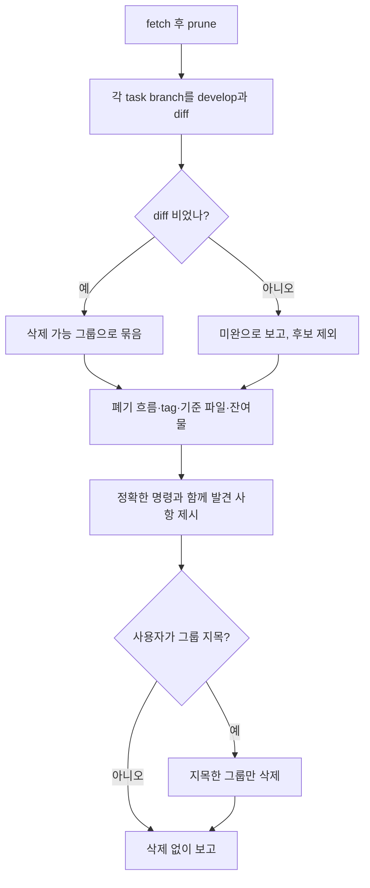

# Repo Hygiene

<!-- jig:skill-source-digest be0b6c73654bd3d847f7842189394daed78acbde -->

[English](../../en/skills/repo-hygiene.md) · [스킬 목록](index.md)

## 개요

`repo-hygiene`은 jig로 오래 작업한 저장소에 쌓이는 잔여물을 점검하고 정리합니다. 작업이 이미 반영된 task branch, 폐기된 흐름이 남긴 branch, 낡은 remote-tracking ref, tag와 release 불일치, 도달하지 못하는 기준 파일, installer 잔여 파일이 대상입니다. 발견한 것은 모두 보고하고, 삭제는 사용자가 지목한 것만 합니다.

## 사용 시점

jig로 한동안 작업해 branch 목록·tag·잔여 파일이 지저분해졌을 때 씁니다. 저장소가 아니라 jig 설치 상태를 보려면 `jig-doctor`를 씁니다.

## 실행 방법과 입력

- Claude Code: `/jig:repo-hygiene`
- Codex·Antigravity: `jig-repo-hygiene`
- 입력: 로컬 clone, `origin`, 해석된 기준 파일 경로, tag·release 대조용 인증된 GitHub profile

## 병합된 branch가 미병합으로 보이는 이유

`develop-task-flow`는 `git merge --squash`로 끝나므로 task branch의 tip이 `develop`의 조상이 되지 않습니다. 그래서 `git branch --merged develop`은 거의 아무것도 못 찾고, `--no-merged`는 몇 달 전에 반영된 작업까지 나열합니다.

이 스킬은 대신 내용으로 분류합니다.

```bash
git diff --quiet develop...<branch>
```

diff가 비어 있으면 SHA와 무관하게 그 branch의 모든 내용이 `develop`에서 도달 가능하다는 뜻이고, 이것이 안전 신호입니다. diff가 남아 있으면 아직 무언가 들고 있는 branch이므로 미완으로 보고하고 삭제 후보로 올리지 않습니다.

## 작업 흐름



## 읽기·변경 범위

branch, ref, tag, GitHub release, 기준 파일 경로, 작업 트리를 읽습니다. 쓰기는 사용자가 확인한 삭제와 `git fetch --prune`이 정리하는 remote-tracking ref뿐입니다. 추적 파일은 수정하지 않습니다.

## 중단 조건과 안전 규칙

- 목록은 동의가 아닙니다. 사용자가 그룹을 지목하기 전에는 아무것도 지우지 않습니다.
- `main`, `develop`, 현재 branch는 건드리지 않습니다.
- `develop`과의 diff가 남아 있는 branch는 삭제하지도, 후보로 올리지도 않습니다.
- 원격 branch·tag·GitHub release는 삭제하지 않습니다. 불일치는 사람이 판단하도록 보고만 합니다.
- `.jig/`는 건드리지 않고, 이력을 다시 쓰는 명령은 실행하지 않습니다.

## 결과물

반영됨·미완·폐기 흐름으로 branch를 묶어 보고하고, 삭제한 것, 정리된 remote-tracking ref 수, tag·release 불일치, 기준 파일의 commit 여부, 남은 잔여물, 건너뛴 점검과 그 이유를 함께 적습니다.

## 관련 스킬

- [`jig-doctor`](jig-doctor.md): jig 설치 진단. 이 스킬은 저장소 정리
- [`develop-task-flow`](develop-task-flow.md): 이 스킬이 나중에 정리하는 task branch를 만듦
- [`github-release`](github-release.md): 이 스킬이 release와 대조하는 tag를 만듦
- [`version-rubric`](version-rubric.md): commit되어야 하는 기준 파일 소유

## 원본

- [`skills/repo-hygiene/SKILL.md`](../../../skills/repo-hygiene/SKILL.md)
