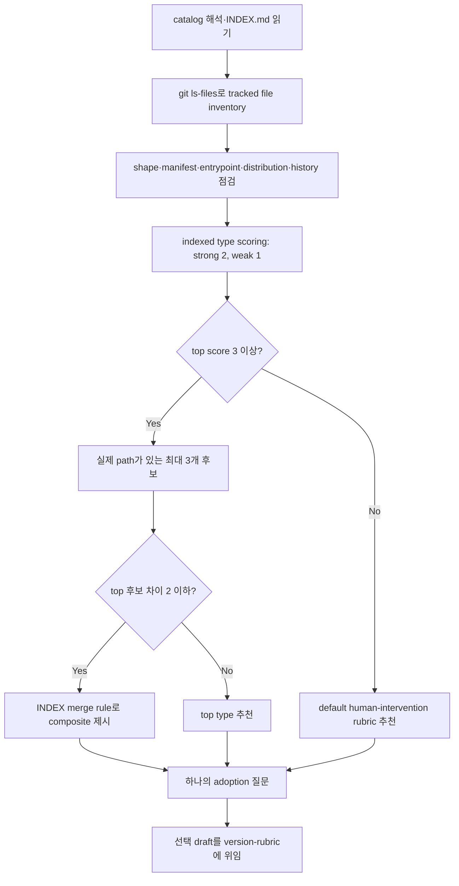

# Rubric Scan

[English](../../en/skills/rubric-scan.md) · [스킬 index](index.md) · [버전 판정 기준](../version-rubric.md)

## 개요

`rubric-scan`은 read-only classifier입니다. tracked repository 증거를 조사하고 배포된 catalog의 project type을 scoring하여 최대 3개의 증거 기반 후보를 보고한 뒤, 선택된 draft를 `version-rubric`에 넘깁니다. `.jig/versioning.md`를 직접 쓰지 않습니다.

## 사용 시점

project type이 불분명한 상태에서 rubric을 처음 만들기 전, 또는 project가 크게 바뀌어 기존 grading axis가 배포물에 맞지 않을 때 실행합니다.

## 실행 방법과 catalog

- Claude Code: `/jig:rubric-scan`
- Codex·Antigravity: `jig-rubric-scan`
- catalog 우선순위: `JIG_RUBRIC_CATALOG`, Claude plugin, project install, jig source repository, user install

type, detection signal, scoring, merge rule은 먼저 `rubrics/INDEX.md`에서 읽습니다. 모든 rubric file이 아니라 candidate body만 읽습니다. catalog가 없으면 type을 지어내지 않고 `version-rubric`의 default를 추천합니다.

## 작업 흐름

tracked file만 증거입니다. dependency 이름, 공개 entrypoint, deployment·install config, 실제 release history는 우연한 script나 untracked output보다 강한 증거입니다.

## 읽기 범위와 결과물

tracked file 이름, 관련 manifest, entrypoint, distribution config, recent commit·tag, catalog index, candidate rubric body를 읽습니다. catalog source, tracked-file shape, 배포 산출물, type·score·evidence path 순위, 추천, grading axis, draft path, 다음 조치를 보고합니다.

## 안전 규칙

- project type을 판정하기 위해 file write·move·delete, install, build, test, network access를 하지 않습니다.
- repository 밖의 file이나 secret 내용을 읽지 않습니다.
- index에 없는 type을 만들거나 handoff로 기존 rubric을 덮어쓰지 않습니다.
- catalog draft는 SemVer consumer compatibility, default는 human intervention을 판정합니다. adoption이 현재 axis를 확장하는 것이 아니라 교체함을 밝힙니다.
- release grading과 note는 `github-release`의 역할입니다.

## 관련 스킬

- [`version-rubric`](version-rubric.md): 선택된 draft와 파일 write 소유
- [`github-release`](github-release.md): 확정된 rubric 소비

## 원본

- [`skills/rubric-scan/SKILL.md`](../../../skills/rubric-scan/SKILL.md)
- [Rubric catalog](../../../skills/version-rubric/rubrics/INDEX.md)
