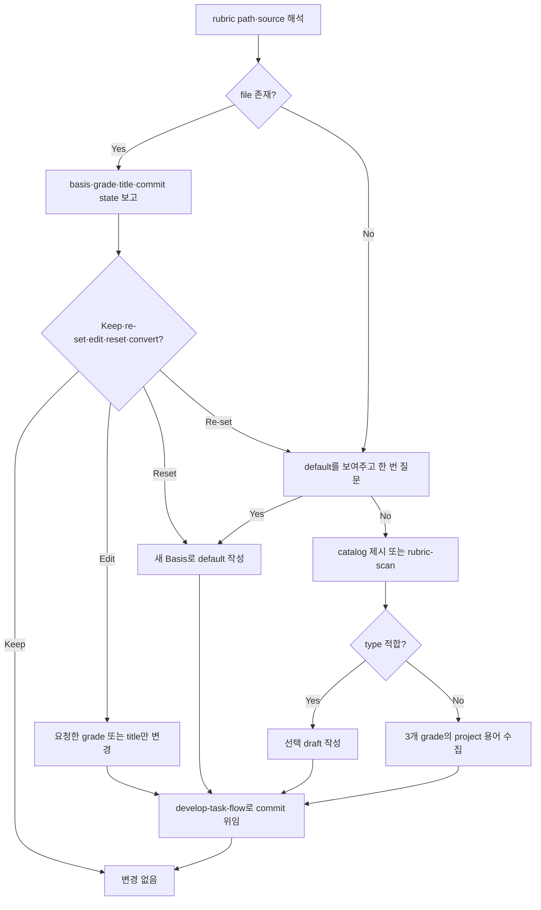

# Version Rubric

<!-- jig:skill-source-digest 6a2e0de923555ca9e170cb92c5d1960b88048fd2 -->

[English](../../en/skills/version-rubric.md) · [스킬 index](index.md) · [Rubric 계약](../version-rubric.md)

## 개요

`version-rubric`은 `JIG_VERSION_RUBRIC`, local `jig.versionRubric`, `.jig/versioning.md` 순서로 해석한 project-owned version policy를 독점적으로 생성·review·re-set·edit합니다. release를 실행하지 않습니다.

## 사용 시점

rubric이 없을 때, project의 `patch`·`minor`·`major` 판정 방식을 review할 때, catalog type adoption, grade 하나 edit, default reset, legacy Korean section title의 명시적 convert에 사용합니다.

## 실행 방법과 file 계약

- Claude Code: `/jig:version-rubric`
- Codex·Antigravity: `jig-version-rubric`
- 필수 section: `## Decision Order`, `## Grade Definitions`
- 선택 section: `## Hard Rules`, `## Interface Paths`, `## Release Notes`, `## Version Format`, `## Pre-Release Checks`

`## Interface Paths`는 path glob을 그 아래 변경이 가질 수 있는 최저 등급에 대응시킵니다. 덕분에 `develop-task-flow`와 `github-release`가 산문 목록을 눈으로 읽는 대신 `git diff --name-only`로 시작 등급을 계산합니다. 처음 걸리는 행이 이기고, 여기서 나온 바닥은 참고값이라 이유를 남기면 더 낮게 낼 수 있습니다.

legacy Korean title도 유효하지만 English title과 한 파일에서 섞으면 안 됩니다. `> Basis:` line은 default adoption, catalog type, project-specific 원천을 기록합니다. clone과 CI가 같은 기준을 쓰도록 file을 commit해야 합니다.

## 작업 흐름

default는 human intervention을, catalog draft는 SemVer consumer compatibility를 판정합니다. 두 axis는 대안이며 question을 섞지 말고 하나를 전체로 adoption해야 합니다.

## 읽기·변경 범위

해석된 rubric, Git commit state, catalog `INDEX.md`, 선택된 catalog draft 하나, repository context를 읽습니다. rubric path와 parent `.jig/` 디렉터만 쓰고, 가능하면 commit을 `develop-task-flow`로 위임합니다. catalog는 shipped payload이므로 project 선택을 기록하기 위해 편집하지 않습니다.

## 판단 지점과 안전 규칙

- 기존 rubric을 교체하기 전에 내용을 보여주고 확인합니다.
- create·re-set 질문에 답하지 않으면 default를 adoption하고 `> Basis:`에 기록합니다.
- 사용자의 언어와 용어를 보존합니다. 임의 rephrase는 향후 grading을 바꾸기 때문입니다.
- 무단 translate·retitle, `.bak` 생성, catalog 편집, release grading, GitHub 설정 변경, 강제 commit을 하지 않습니다.
- untracked·uncommitted rubric을 덮어쓰기 전에 경고합니다.

## 결과물

path·source, basis, title spelling, 3개 grade question, action, draft source, commit state, 다음 조치를 보고합니다.

## 관련 스킬

- [`rubric-scan`](rubric-scan.md): write 없이 catalog type 추천
- [`github-release`](github-release.md): 확정된 rubric 읽기
- [`jig-setup`](jig-setup.md): rubric 누락 시 생성 위임
- [`jig-doctor`](jig-doctor.md): missing·broken·uncommitted rubric 진단

## 원본

- [`skills/version-rubric/SKILL.md`](../../../skills/version-rubric/SKILL.md)
- [Rubric catalog](../../../skills/version-rubric/rubrics/INDEX.md)
- [사용자 계약](../version-rubric.md)
